# M2 Differentiable IO Term Implementation Plan

> **For agentic workers:** REQUIRED SUB-SKILL: Use superpowers:subagent-driven-development (recommended) or superpowers:executing-plans to implement this plan task-by-task. Steps use checkbox (`- [ ]`) syntax for tracking.

**Goal:** 交付 S1 軟歸屬 + S2 乘積式 crossing surrogate 的可微 IO 項並接進 DREAMPlace GP,在同線長水準(`Δhpwl ≤ +2%`)下把 `io_count` 相對 flat 壓低 `≥5%` 且超過 `3σ_rep`,同時完成 reweighting vs 可微項的 ablation。

**Architecture:** 全部新程式碼住在本 repo 的 `ioplace/ops/`(數學核心)、`ioplace/schedules.py`(排程)、`ioplace/dp_hook.py`(整合 helper)、`ioplace/drivers/run_placement_io.py`(driver);對 DREAMPlace 的唯一改動是一個 python-only patch(`params._extra_obj_terms` 承載的 per-instance objective 附加項 + 暴露 optimizer/model),沿用 M1 的 `dp_patch/` 慣例、不需 cmake rebuild。數學核心先交付語意正確的 reference 實作(T2a),再交付規模契約合格的 chunked-k 生產實作(T2b),兩者以等價測試綁定。

**Tech Stack:** Python 3.12(`$DP/.venv312`)、PyTorch 2.8.0+cu128、numpy 1.26.x、pytest、DREAMPlace fork(branch `io-aware`)、NVIDIA L4 23GB。

**對應設計:** `docs/superpowers/specs/2026-08-06-m2-differentiable-io-design.md`(v2,以下簡稱「設計」)。本計畫的每個 task 對應設計 §11 的同名 task(T2 依 controller 裁決拆成 T2a/T2b)。

---

## Global Constraints

所有 task 隱含繼承下列約束,不再逐 task 重述。

- **pytest 一律** `/nashome/NVL4/vdalab/yyds-dev/DREAMPlace/.venv312/bin/python -m pytest`(以下 `$PY`);cwd = repo 根目錄 `/nashome/NVL4/vdalab/yyds-dev/IO-Aware-Top-Level-Placer`。開發時可加 `-m "not slow"`,**task 收尾必須跑完整套件**。
- **GPU** = 單卡 NVIDIA L4 23GB;所有 placement dtype 主線 float32(config `"dtype": "float32"`)。
- **`ioplace/evaluator_ref.py` 與 `ioplace/evaluator_gpu.py` 是唯一計分尺,M2 不改其既有輸出的語意或數值。** T5 只**新增** `hard_lambda_sum` / `per_net_lambda` 兩個欄位,既有欄位必須逐位元不變(由既有等價測試把關)。一切 exit 判定與報表數字取 `evaluator_ref`。
- **DP 修改只能走** `ioplace/dp_patch/*.patch` + 同步 `$DP/install/`;`$DP=/nashome/NVL4/vdalab/yyds-dev/DREAMPlace`,branch `io-aware`;**python-only,不得觸發 cmake rebuild**。每個被改的檔案要同時改 `$DP/dreamplace/X.py` 與 `$DP/install/dreamplace/X.py`。
- **optimizer lock:** driver 啟動時 assert `params.optimizer(global_place_stages[0]["optimizer"]) == "nesterov"`、`params.use_bb`(經 `PlaceDB.initialize` 解析後)`== 0`、`global_place_stages[0].get("Lsub_iteration", 1) == 1`。任一不符即 raise。
- **net 過濾:** IO 項只作用於 `2 <= deg' < params.ignore_net_degree`(ISPD2005 config 為 100)的 net,與 DP 的 `net_mask_ignore_large_degrees`(`$DP/dreamplace/BasicPlace.py:159-163`)**逐位元同義**;`deg'` = per-net 去重後的 node 數,但 mask 的判定用**原始 pin degree**(與 DP 一致)。
- **提交路徑絕不 materialize `(N,K)` 或 `(P,K)` 張量**(設計 §2.5 chunked-k 契約)。T2a 的 reference 實作是唯一例外,且**不得**被 driver 使用;違反 = review reject。
- **`w_e = 1` 是暫定預設**,附設計 §3.2.1 的 A4 必跑推翻條件;`margin` 項為 `softplus((d*+m)/τ_m)`,flag 預設關(`rho_margin=0.0`)。
- **fixed / filler node 的 IO 梯度必須恆為 0**(`idx >= num_movable_nodes`),由單元測試鎖死;`detailed_place_flag=0` 慣例沿用(`ioplace/drivers/run_placement.py:43-44`)。
- **τ 與 ρ 每 iteration 連續更新**;任何離散 schedule 事件(IO 項啟用、`ratio_ema` 重算、`w_e` 校準、margin 開/關)之後**必須**呼叫 `refresh_nesterov_secant(optimizer)`。
- **`deterministic_flag` 協定照設計 §7.2:** T6 先在 `det ∈ {0,1}` 兩 regime 量 `σ_rep` 並機械裁決 regime,T7 之後全部 arm(含重測的 flat 基準)統一用該 regime。
- **本機無外網:** 不得新增 pip 依賴(只用已裝的 torch / numpy / scipy / pytest / mtkahypar),不得 `git fetch` / `git push`。
- **branch = `m2-differentiable-io`;每個 task 完成即 commit**,訊息為英文,結尾加 `Co-Authored-By: Claude Fable 5 <noreply@anthropic.com>`。
- **探針來源:** session scratchpad 已快照到 `.superpowers/sdd/probes-staging/`,T0 從那裡取檔,**不得依賴 `/tmp`**。該目錄另有 M0/M1 遺留的 `probe_*.py`(`probe_adaptec1/div/red/regions/sub/ties`),**不屬於 M2,不要搬**。
- **單元測試不得依賴大 benchmark**;需要 GPU 的測試沿用 `tests/test_evaluator_gpu.py:1-5` 的 skip 樣板;需要真實 placement 的測試標 `@pytest.mark.slow`。

---

## Task 0 (T0): 把 M2 的數值證據變成可重現資產

**Files:**
- Create: `ioplace/diagnostics/probes_m2/__init__.py`, `ioplace/diagnostics/probes_m2/probe1_numerics.py`, `probe2_scale.py`, `probe3_grad.py`, `probe4_loo_grad.py`, `probe5_naive_vs_stable.py`, `probe6_mem.py`, `probe7_gap.py`, `probe8_secant.py`, `ioplace/diagnostics/probes_m2/run_all.py`
- Test: `tests/test_probes_regression.py`
- Produces (資料): `results/m2/probes/env.json`, `results/m2/probes/probe{1..8}.json`

**Interfaces:**
- Consumes: `.superpowers/sdd/probes-staging/probe{1_numerics,2_scale,3_grad,4,5,6_mem,7_gap,8_secant}.py`(來源檔,搬移後改名如上);`ioplace.netlist.load_netlist`、`ioplace.drivers.run_placement.get_regions_for`、`ioplace.region_grid.RegionGrid`、`ioplace.evaluator_gpu.GpuEvalContext`。
- Produces:
  - 每個 probe 模組暴露 `def run() -> dict`(純資料,JSON-serializable),`if __name__ == "__main__"` 印出。
  - `run_all.py` 暴露 `def main(out_dir: str = "results/m2/probes") -> None`,寫出 `env.json`(欄位:`torch_version`、`cuda_version`、`gpu_name`、`dp_commit`、`ioplace_commit`、`numpy_version`、`input_sha256`(dict: npz 路徑 → sha256))與每個 probe 的 `probe{n}.json`。

- [ ] **Step 1: 搬檔並改名(不改內容)**

```bash
cd /nashome/NVL4/vdalab/yyds-dev/IO-Aware-Top-Level-Placer
mkdir -p ioplace/diagnostics/probes_m2 results/m2/probes
touch ioplace/diagnostics/probes_m2/__init__.py
S=.superpowers/sdd/probes-staging
cp $S/probe1_numerics.py ioplace/diagnostics/probes_m2/probe1_numerics.py
cp $S/probe2_scale.py    ioplace/diagnostics/probes_m2/probe2_scale.py
cp $S/probe3_grad.py     ioplace/diagnostics/probes_m2/probe3_grad.py
cp $S/probe4.py          ioplace/diagnostics/probes_m2/probe4_loo_grad.py
cp $S/probe5.py          ioplace/diagnostics/probes_m2/probe5_naive_vs_stable.py
cp $S/probe6_mem.py      ioplace/diagnostics/probes_m2/probe6_mem.py
cp $S/probe7_gap.py      ioplace/diagnostics/probes_m2/probe7_gap.py
cp $S/probe8_secant.py   ioplace/diagnostics/probes_m2/probe8_secant.py
```
Expected: 8 個檔案存在;`ls ioplace/diagnostics/probes_m2 | wc -l` == 9(含 `__init__.py`)。

- [ ] **Step 2: 修好 `probe3_grad.py` 的 `grad_loo`(這是本 task 的核心缺陷修復)**

`probe3_grad.py` 內的 `grad_loo()` 有兩個錯誤,**必須**照設計 §13 的記載修掉:
1. 它用 `surrog = (ell[p2n] * coef).sum()` 反傳,等於在正確的 leave-one-out 係數上又多乘一個 `d ell/d p = -1/(1-p)` 因子;
2. `one_minus_p` 用 `clamp_min(floor)`,而 `clamp_min` 在被夾住的分支**梯度為 0**,把飽和 cell 的梯度靜默清成 0。

正確作法(與 `probe4_loo_grad.py` 的 `io_forward_and_grad` 一致):係數作用在 `p` 而不是 `ell`,且 detach:

```python
def grad_loo(x, y, tau):
    """log-space leave-one-out backward: dL/dp_{i,k} = exp(S_{e,k} - ell_{i,k})."""
    x = x.detach().clone().requires_grad_(True); y = y.detach().clone().requires_grad_(True)
    p, ell = stable_p_and_ell(x, y, tau)          # 見 probe4_loo_grad.stable_p_and_ell
    ellp = ell[pin2node]
    S = torch.zeros((n_nets, K), device=dev).index_add_(0, pin2net, ellp)
    lam = (1.0 - torch.exp(S)).sum(1)
    with torch.no_grad():
        c = torch.exp(S[pin2net] - ellp) * ((lam - 1.0) > 0).float()[pin2net].unsqueeze(1)
    surrog = (p[pin2node] * c).sum()              # 係數作用在 p,不是 ell
    return torch.autograd.grad(surrog, [x, y])
```

- [ ] **Step 3: 每個 probe 加上 `run() -> dict` 包裝**

把每個 probe 的 `print(...)` 改成先組出 dict、再 `print(json.dumps(...))`;`run()` 回傳同一個 dict。`probe2_scale.py`/`probe4_loo_grad.py`/`probe5_naive_vs_stable.py`/`probe6_mem.py`/`probe7_gap.py` 需要 case 參數的,簽名為 `run(case: str = "adaptec1", k: int = 16) -> dict`。`probe7_gap.py` 額外**補上 v1 未輸出的 `adaptec1 k=8` 那格**,並對每個 case 加算 `spearman_rho`(用 `scipy.stats.spearmanr`,只取 `per_net_crossings > 0` 的 net)。

- [ ] **Step 4: 寫 `run_all.py`**

```python
import hashlib, json, os, subprocess, sys
import numpy as np, torch
from ioplace.diagnostics.probes_m2 import (probe1_numerics, probe2_scale, probe3_grad,
    probe4_loo_grad, probe5_naive_vs_stable, probe6_mem, probe7_gap, probe8_secant)

DP = os.environ.get("DREAMPLACE_ROOT", "/nashome/NVL4/vdalab/yyds-dev/DREAMPlace")
REPO = os.path.dirname(os.path.dirname(os.path.dirname(os.path.dirname(os.path.abspath(__file__)))))
NPZ = ["results/m1/adaptec1_reweight_k8_grid.json.npz",
       "results/m1/adaptec1_reweight_k16_grid.json.npz",
       "results/m1/adaptec1_reweight_k32_grid.json.npz",
       "results/m1/bigblue4_reweight_k16_grid.json.npz"]

def _git(path):
    return subprocess.check_output(["git", "-C", path, "rev-parse", "HEAD"]).decode().strip()

def _sha(path):
    h = hashlib.sha256()
    with open(path, "rb") as f:
        for blk in iter(lambda: f.read(1 << 20), b""):
            h.update(blk)
    return h.hexdigest()

def main(out_dir="results/m2/probes"):
    os.makedirs(out_dir, exist_ok=True)
    env = {"torch_version": torch.__version__, "cuda_version": torch.version.cuda,
           "gpu_name": torch.cuda.get_device_name(0) if torch.cuda.is_available() else None,
           "numpy_version": np.__version__, "dp_commit": _git(DP), "ioplace_commit": _git(REPO),
           "input_sha256": {p: _sha(os.path.join(REPO, p)) for p in NPZ}}
    json.dump(env, open(os.path.join(out_dir, "env.json"), "w"), indent=1)
    jobs = [("probe1", probe1_numerics.run, {}), ("probe2", probe2_scale.run, {}),
            ("probe3", probe3_grad.run, {}), ("probe4", probe4_loo_grad.run, {}),
            ("probe5", probe5_naive_vs_stable.run, {}), ("probe6", probe6_mem.run, {"case": "bigblue4"}),
            ("probe7", probe7_gap.run, {}), ("probe8", probe8_secant.run, {})]
    for name, fn, kw in jobs:
        json.dump(fn(**kw), open(os.path.join(out_dir, f"{name}.json"), "w"), indent=1)
        print(f"[probes_m2] wrote {name}.json")

if __name__ == "__main__":
    main(*sys.argv[1:])
```

- [ ] **Step 5: Write the failing regression test**

`tests/test_probes_regression.py`(**小型合成 case,不碰大 benchmark**):
```python
import numpy as np
import pytest
torch = pytest.importorskip("torch")
if not torch.cuda.is_available():
    pytest.skip("needs CUDA", allow_module_level=True)

from ioplace.regions import make_grid_regions
from ioplace.region_grid import RegionGrid
from ioplace.evaluator_ref import evaluate
from tests.test_evaluator_gpu import _random_case

DIE = (0., 0., 100., 100.)

def _sdf_l1(x, y, rects):
    dx = torch.maximum(rects[:, 0][None] - x[:, None], x[:, None] - rects[:, 2][None])
    dy = torch.maximum(rects[:, 1][None] - y[:, None], y[:, None] - rects[:, 3][None])
    return dx.clamp(min=0) + dy.clamp(min=0) + torch.maximum(dx, dy).clamp(max=0)

def _toy(dev, tau, clamp):
    """1 net of 4 nodes, all deep inside region 0 -> softmax saturates to exactly 1.0."""
    rects = torch.tensor([[0., 0., 50., 100.], [50., 0., 100., 100.]], device=dev)
    x = torch.tensor([5., 6., 7., 8.], device=dev, requires_grad=True)
    y = torch.tensor([50., 50., 50., 50.], device=dev, requires_grad=True)
    p = torch.softmax(-_sdf_l1(x, y, rects) / tau, dim=1)
    pp = p if clamp is None else p.clamp(max=1 - clamp)
    ell = torch.log1p(-pp)
    S = ell.sum(dim=0, keepdim=True)
    L = (1 - torch.exp(S)).sum()
    g = torch.autograd.grad(L, [x, y], allow_unused=True)
    return g

def test_unguarded_naive_autograd_produces_nan():
    """RED evidence for design v2 R3: without a clamp/floor guard the product-form
    surrogate yields 0*inf = NaN exactly where cells sit deep inside a region."""
    gx, gy = _toy("cuda", tau=1.0, clamp=None)
    assert torch.isnan(gx).any() or torch.isnan(gy).any()

def test_guarded_path_is_nan_free():
    gx, gy = _toy("cuda", tau=1.0, clamp=1e-7)
    assert torch.isfinite(gx).all() and torch.isfinite(gy).all()

@pytest.mark.parametrize("seed", [0, 1, 2])
def test_hard_lambda_sum_is_a_lower_bound_on_io_count(seed):
    """design v2 sec 3.2.5: sum_e (Lambda_e - 1) <= io_count always holds."""
    rng = np.random.default_rng(seed)
    rg = RegionGrid(make_grid_regions(DIE, 4, 4, lattice=20))
    nl = _random_case(rng)
    res = evaluate(nl, nl.node_x, nl.node_y, rg)
    bm = rg.pin_region_bitmask(nl, nl.node_x, nl.node_y)
    lam = np.array([bin(int(v)).count("1") for v in bm])
    deg2 = nl.net_degrees >= 2
    assert int(np.maximum(lam - 1, 0)[deg2].sum()) <= res.io_count
```

- [ ] **Step 6: Run test to verify it fails**

```bash
$PY -m pytest tests/test_probes_regression.py -v
```
Expected: FAIL — `ModuleNotFoundError: No module named 'tests.test_evaluator_gpu'` 不會發生(該檔已存在),實際預期的失敗是 collection 通過但 `test_unguarded_naive_autograd_produces_nan` 尚未有 `_random_case` 的 import 錯或 3 個測試因尚未建立 `results/m2/probes` 而無關——**若三個測試直接 PASS 也可接受**(它們驗的是既有行為,不是新程式碼);此時把 Step 6 標記為「N/A:純回歸鎖」並繼續。真正的 RED 在 Step 7。

- [ ] **Step 7: 跑 `run_all.py` 並校驗設計文件數字**

```bash
cd /nashome/NVL4/vdalab/yyds-dev/IO-Aware-Top-Level-Placer
PYTHONPATH=. $PY -m ioplace.diagnostics.probes_m2.run_all
```
Expected: `results/m2/probes/` 產出 `env.json` + `probe1.json`..`probe8.json`(共 9 檔)。
逐項比對設計文件,**不符即以重跑值更新設計文件並在 commit message 註明**:
- `probe3.json`:`nan_count` 在 τ_rel=0.05 為 14,674、τ_rel=0.02 為 193,798(設計 §3.2.2)。**修好 `grad_loo` 後,梯度數字預期改變;NaN 計數與該 bug 無關,預期不變。**
- `probe4.json`:`‖∇L_IO‖₁` 在 τ_rel ∈ {0.5,0.3,0.2,0.1,0.05,0.02,0.01} 為 {66.8, 143.4, 206.8, 236.2, 229.1, 209.7, 190.9}(設計 §4.1,±2%)。
- `probe6.json`:bigblue4 peak 在 K={8,16,32} 為 {2431, 4696, 9229} MB(設計 §2.3,±5%)。
- `probe7.json`:`io/(Λ−1)` 在 adaptec1 k16 / k32 / bigblue4 k16 為 {1.238, 1.358, 1.190}(設計 §3.2.5,精確)。
- `probe8.json`:不刷新時 `alpha_after / alpha_before < 1e-3`、刷新時 `|alpha_after/alpha_before − 1| < 0.01`(設計 §6.4.1)。

- [ ] **Step 8: Run tests**

```bash
$PY -m pytest tests/test_probes_regression.py -v
$PY -m pytest -m "not slow" -q
```
Expected: `tests/test_probes_regression.py` 5 passed;既有套件全綠(無回歸)。

- [ ] **Step 9: Commit**

```bash
git add ioplace/diagnostics/probes_m2 tests/test_probes_regression.py results/m2/probes \
        docs/superpowers/specs/2026-08-06-m2-differentiable-io-design.md
git commit -m "chore(m2): commit reproducible probes, fix probe3 leave-one-out gradient

Co-Authored-By: Claude Fable 5 <noreply@anthropic.com>"
```

---

## Task 1 (T1): S1 軟歸屬模組

**Files:**
- Create: `ioplace/ops/__init__.py`, `ioplace/ops/soft_assign.py`
- Test: `tests/test_soft_assign.py`

**Interfaces:**
- Consumes: `ioplace.regions.RegionSet`、`ioplace.region_grid.RegionGrid`。
- Produces(**下游 task 唯一可依賴的簽名**):
  - `rect_table(rs: RegionSet) -> tuple[np.ndarray, np.ndarray]` — `(rects (R,4) float64 [xl,yl,xh,yh], rect2region (R,) int64)`;`R = Σ_k len(rects(k))`。
  - `region_sdf_l1(x: Tensor, y: Tensor, rects: Tensor, rect2region: Tensor, k_lo: int, k_hi: int) -> Tensor` — 回傳 `(N, k_hi-k_lo)`,`out[:, j]` = 到 region `k_lo+j` 的 L1 signed distance(多矩形取 hard-min)。`x`/`y` shape `(N,)`,dtype 與 `rects` 一致。
  - `softmax_stats(x, y, rects, rect2region, K: int, tau: float, chunk: int | None = None) -> tuple[Tensor, Tensor, Tensor]` — `(m (N,), t (N,), argmax (N,) int64)`;`m = max_k z_k`(`z_k = −d_k/τ`),`t = Σ_{j≠argmax} exp(z_j − m)`(**排除 argmax 的 chunked 加總,不得寫成 `s − 1`**),`argmax` 為 first-occurrence tie-break。
  - `chunk_p_ell(sdf_chunk: Tensor, m: Tensor, t: Tensor, argmax: Tensor, k_lo: int, tau: float, floor: float = 1e-30) -> tuple[Tensor, Tensor]` — `(p (N,c), ell (N,c))`,`ell = log(1−p)`。
  - `d_star_from_m(m: Tensor, tau: float) -> Tensor` — `(N,)`,`= −τ·m`(到「自己 region」邊界的 signed distance,內部為負)。

**設計依據:** `docs/superpowers/specs/2026-08-06-m2-differentiable-io-design.md` §2.1(L1 box SDF 與 hard-min)、§2.5(chunked 契約的 FWD-1)。

**§2.2 的數值安全形式(逐字複製自設計,不得改寫):**

> 直接 `torch.log1p(-torch.softmax(...))` 在 fp32 下會產生 `−inf`,再與 `exp(S)=0` 相乘產生 **NaN**。定案的穩定寫法(逐 k-chunk 執行,見 §2.5):
>
> ```python
> z = -sdf / tau                                   # (N, c) — c = chunk 內的 region 數
> m, am = z_full.max(dim=1)                        # 全 K 的 max(pass 1 得到,(N,))
> e = torch.exp(z - m.unsqueeze(1))                # e[argmax] == 1.0
> # s = 1 + t,  t = Σ_{j≠argmax} e_j  由 pass 1 以 k-chunk 累加得到,**無抵消誤差**
> p   = e / s.unsqueeze(1)
> omp = torch.where(is_argmax, (t / s).unsqueeze(1).expand_as(e), (s.unsqueeze(1) - e) / s.unsqueeze(1)).clamp_min(1e-30)
> ell = torch.log(omp)                             # = log(1 - p),下限 −69
> ```
>
> 關鍵在 `t`:對 `k = argmax`,`1 − p_k = t/(1+t)` 是**直接算出來的**,不是 `s − e_k` 的災難性相減;對 `k ≠ argmax`,`(s − e_k)` 只在兩個 logit 幾乎打平時才有相減,而那時 `1−p_k ≈ 0.5`,沒有精度問題。`t` 必須以「排除 argmax 的 k-chunked 加總」求得,**不可**寫成 `s − 1`。

- [ ] **Step 1: Write the failing test**

`tests/test_soft_assign.py`:
```python
import numpy as np
import pytest
torch = pytest.importorskip("torch")

from ioplace.regions import make_grid_regions, RegionSet, RegionSpec
from ioplace.region_grid import RegionGrid
from ioplace.ops.soft_assign import (rect_table, region_sdf_l1, softmax_stats,
                                     chunk_p_ell, d_star_from_m)

DIE = (0., 0., 100., 100.)
DEV = "cuda" if torch.cuda.is_available() else "cpu"

def _t(a, dtype=torch.float64):
    return torch.as_tensor(np.asarray(a), dtype=dtype, device=DEV)

def _tables(rs):
    r, r2k = rect_table(rs)
    return _t(r), torch.as_tensor(r2k, device=DEV)

def test_rect_table_shapes_and_mapping():
    rs = make_grid_regions(DIE, 2, 2, lattice=10)
    rects, r2k = rect_table(rs)
    assert rects.shape == (4, 4) and r2k.shape == (4,)
    assert list(r2k) == [0, 1, 2, 3]
    assert np.allclose(rects[0], [0., 0., 50., 50.])
    assert np.allclose(rects[3], [50., 50., 100., 100.])

def test_sdf_single_rect_analytic():
    """K=2 vertical split: P0=[0,50]x[0,100], P1=[50,100]x[0,100]."""
    rs = make_grid_regions(DIE, 2, 1, lattice=10)
    rects, r2k = _tables(rs)
    x = _t([25., 75., 60., 0., 50.]); y = _t([50., 50., 110., 0., 50.])
    d = region_sdf_l1(x, y, rects, r2k, 0, 2)
    assert d.shape == (5, 2)
    assert d[0].tolist() == pytest.approx([-25., 25.])   # inside P0, 25 from boundary
    assert d[1].tolist() == pytest.approx([25., -25.])
    assert d[2].tolist() == pytest.approx([20., 10.])    # outside die (corner), L1
    assert d[3].tolist() == pytest.approx([0., 50.])     # die corner, on P0 boundary
    assert d[4].tolist() == pytest.approx([0., 0.])      # exactly on the shared edge

def test_sdf_rectilinear_hard_min():
    """L-shaped region 0 = [0,10]x[0,20] U [10,20]x[0,10]; region 1 = the rest."""
    rs = RegionSet(die=(0., 0., 40., 20.), lattice=4, regions=[
        RegionSpec("L", np.array([[0., 0., 10., 20.], [10., 0., 20., 10.]])),
        RegionSpec("R", np.array([[10., 10., 20., 20.], [20., 0., 40., 20.]]))])
    rects, r2k = _tables(rs)
    assert rects.shape == (4, 4) and list(r2k.cpu().numpy()) == [0, 0, 1, 1]
    x = _t([15., 5., 15., 25.]); y = _t([15., 5., 5., 5.])
    d = region_sdf_l1(x, y, rects, r2k, 0, 1)[:, 0]
    assert d.tolist() == pytest.approx([5., -5., -5., 5.])

def test_sdf_chunk_slice_matches_full():
    rs = make_grid_regions(DIE, 4, 4, lattice=16)
    rects, r2k = _tables(rs)
    rng = np.random.default_rng(0)
    x = _t(rng.uniform(0, 100, 200)); y = _t(rng.uniform(0, 100, 200))
    full = region_sdf_l1(x, y, rects, r2k, 0, 16)
    for lo, hi in [(0, 4), (4, 9), (9, 16)]:
        assert torch.equal(region_sdf_l1(x, y, rects, r2k, lo, hi), full[:, lo:hi])

@pytest.mark.parametrize("chunk", [None, 1, 3, 16])
def test_softmax_stats_chunk_invariant(chunk):
    rs = make_grid_regions(DIE, 4, 4, lattice=16)
    rects, r2k = _tables(rs)
    rng = np.random.default_rng(1)
    x = _t(rng.uniform(0, 100, 500)); y = _t(rng.uniform(0, 100, 500))
    m, t, am = softmax_stats(x, y, rects, r2k, 16, tau=7.0, chunk=chunk)
    m0, t0, am0 = softmax_stats(x, y, rects, r2k, 16, tau=7.0, chunk=None)
    assert torch.equal(m, m0) and torch.equal(am, am0)
    assert torch.allclose(t, t0, rtol=0, atol=1e-12)

def test_t_excludes_argmax_and_never_cancels():
    """t must be summed over j != argmax; s-1 would lose all precision when the
    winner dominates (design v2 sec 2.2). gap=500 keeps exp(-gap) representable
    (~7.1e-218), so a naive s-1 implementation erases it (1 + 7.1e-218 == 1.0 in
    fp64) while direct summation over j != argmax preserves it — this is what
    makes the case discriminating."""
    rs = make_grid_regions(DIE, 2, 1, lattice=10)
    rects, r2k = _tables(rs)
    x = _t([25.]); y = _t([50.])
    m, t, am = softmax_stats(x, y, rects, r2k, 2, tau=0.1)   # gap 50 / 0.1 = 500
    assert int(am.item()) == 0
    assert t.item() > 0.0 and np.isfinite(t.item())
    assert t.item() == pytest.approx(np.exp(-500.0), rel=1e-6, abs=0.0)

def test_ell_matches_log1p_in_unsaturated_region():
    rs = make_grid_regions(DIE, 4, 4, lattice=16)
    rects, r2k = _tables(rs)
    rng = np.random.default_rng(2)
    x = _t(rng.uniform(20, 80, 300)); y = _t(rng.uniform(20, 80, 300))
    tau = 30.0
    m, t, am = softmax_stats(x, y, rects, r2k, 16, tau)
    sdf = region_sdf_l1(x, y, rects, r2k, 0, 16)
    p, ell = chunk_p_ell(sdf, m, t, am, 0, tau)
    ref = torch.softmax(-sdf / tau, dim=1)
    assert torch.allclose(p, ref, rtol=1e-10, atol=1e-12)
    assert torch.allclose(ell, torch.log1p(-ref), rtol=1e-6, atol=1e-8)

def test_ell_finite_and_bounded_when_saturated():
    rs = make_grid_regions(DIE, 2, 1, lattice=10)
    rects, r2k = _tables(rs)
    x = _t([5., 10., 45.]); y = _t([50., 50., 50.])
    tau = 1e-4 * 50.0
    m, t, am = softmax_stats(x, y, rects, r2k, 2, tau)
    sdf = region_sdf_l1(x, y, rects, r2k, 0, 2)
    p, ell = chunk_p_ell(sdf, m, t, am, 0, tau)
    assert torch.isfinite(ell).all()
    assert float(ell.min()) >= -70.0

def test_argmax_recovers_hard_region_assignment():
    rs = make_grid_regions(DIE, 4, 4, lattice=20)
    rg = RegionGrid(rs)
    rects, r2k = _tables(rs)
    rng = np.random.default_rng(3)
    xs = rng.uniform(0.6, 99.4, 1000); ys = rng.uniform(0.6, 99.4, 1000)
    m, t, am = softmax_stats(_t(xs), _t(ys), rects, r2k, 16, tau=1e-3)
    assert np.array_equal(am.cpu().numpy(), rg.region_of_points(xs, ys).astype(np.int64))

def test_d_star_equals_min_sdf():
    rs = make_grid_regions(DIE, 4, 4, lattice=16)
    rects, r2k = _tables(rs)
    rng = np.random.default_rng(4)
    x = _t(rng.uniform(0, 100, 200)); y = _t(rng.uniform(0, 100, 200))
    tau = 3.0
    m, t, am = softmax_stats(x, y, rects, r2k, 16, tau)
    d = region_sdf_l1(x, y, rects, r2k, 0, 16)
    assert torch.allclose(d_star_from_m(m, tau), d.min(dim=1).values, rtol=1e-12, atol=1e-9)

def test_sdf_gradient_matches_finite_difference():
    rs = make_grid_regions(DIE, 2, 2, lattice=10)
    rects, r2k = _tables(rs)
    x = _t([13.0, 71.0]).requires_grad_(True); y = _t([27.0, 62.0]).requires_grad_(True)
    d = region_sdf_l1(x, y, rects, r2k, 0, 4)
    (d.sum()).backward()
    gx = x.grad.clone()
    h = 1e-6
    for i in range(2):
        xp = x.detach().clone(); xp[i] += h
        xm = x.detach().clone(); xm[i] -= h
        fd = (region_sdf_l1(xp, y.detach(), rects, r2k, 0, 4).sum()
              - region_sdf_l1(xm, y.detach(), rects, r2k, 0, 4).sum()) / (2 * h)
        assert float(gx[i]) == pytest.approx(float(fd), abs=1e-5)

@pytest.mark.parametrize("tau", [1e-4 * 50.0, 10.0 * 50.0])
def test_no_nan_at_extreme_tau(tau):
    rs = make_grid_regions(DIE, 4, 4, lattice=16)
    rects, r2k = _tables(rs)
    rng = np.random.default_rng(5)
    x = _t(rng.uniform(0, 100, 400)); y = _t(rng.uniform(0, 100, 400))
    m, t, am = softmax_stats(x, y, rects, r2k, 16, tau)
    sdf = region_sdf_l1(x, y, rects, r2k, 0, 16)
    p, ell = chunk_p_ell(sdf, m, t, am, 0, tau)
    assert torch.isfinite(m).all() and torch.isfinite(t).all()
    assert torch.isfinite(p).all() and torch.isfinite(ell).all()
```

- [ ] **Step 2: Run test to verify it fails**

```bash
$PY -m pytest tests/test_soft_assign.py -v
```
Expected: FAIL — `ModuleNotFoundError: No module named 'ioplace.ops'`。

- [ ] **Step 3: Write implementation**

`ioplace/ops/__init__.py` 為空檔。`ioplace/ops/soft_assign.py`:

```python
"""S1 soft region assignment (design v2 sec 2.1/2.2/2.5).

All functions are chunk-aware: nothing here ever allocates a full (N,K) tensor
unless the caller explicitly asks for k_hi-k_lo == K.
"""
import numpy as np
import torch


def rect_table(rs):
    rects, r2k = [], []
    for rid, r in enumerate(rs.regions):
        arr = np.asarray(r.rects, dtype=np.float64).reshape(-1, 4)
        rects.append(arr)
        r2k.append(np.full(len(arr), rid, dtype=np.int64))
    return np.concatenate(rects, axis=0), np.concatenate(r2k, axis=0)


def region_sdf_l1(x, y, rects, rect2region, k_lo, k_hi):
    """(N,), (N,), (R,4), (R,) -> (N, k_hi-k_lo) L1 signed distance."""
    c = k_hi - k_lo
    sel = (rect2region >= k_lo) & (rect2region < k_hi)
    sub = rects[sel]                                  # (r,4)
    col = (rect2region[sel] - k_lo)                   # (r,) in [0,c)
    dx = torch.maximum(sub[:, 0][None] - x[:, None], x[:, None] - sub[:, 2][None])
    dy = torch.maximum(sub[:, 1][None] - y[:, None], y[:, None] - sub[:, 3][None])
    d = dx.clamp(min=0) + dy.clamp(min=0) + torch.maximum(dx, dy).clamp(max=0)   # (N,r)
    out = torch.full((x.shape[0], c), float("inf"), dtype=d.dtype, device=d.device)
    out = out.scatter_reduce(1, col[None].expand(x.shape[0], -1), d,
                             reduce="amin", include_self=True)
    return out


def _chunks(K, chunk):
    if chunk is None or chunk >= K:
        return [(0, K)]
    return [(lo, min(lo + chunk, K)) for lo in range(0, K, chunk)]


def softmax_stats(x, y, rects, rect2region, K, tau, chunk=None):
    """Pass 1 of the chunked contract: (m, t, argmax) over ALL K regions."""
    n = x.shape[0]
    dev, dt = x.device, x.dtype
    m = torch.full((n,), -float("inf"), dtype=dt, device=dev)
    am = torch.zeros(n, dtype=torch.int64, device=dev)
    for lo, hi in _chunks(K, chunk):
        z = -region_sdf_l1(x, y, rects, rect2region, lo, hi) / tau
        cm, ci = z.max(dim=1)
        upd = cm > m                       # strict > keeps first-occurrence tie-break
        m = torch.where(upd, cm, m)
        am = torch.where(upd, ci + lo, am)
    t = torch.zeros(n, dtype=dt, device=dev)
    for lo, hi in _chunks(K, chunk):
        z = -region_sdf_l1(x, y, rects, rect2region, lo, hi) / tau
        e = torch.exp(z - m.unsqueeze(1))
        is_am = (am.unsqueeze(1) == torch.arange(lo, hi, device=dev).unsqueeze(0))
        t = t + (e * (~is_am)).sum(dim=1)   # exclude the argmax term -- never s-1
    return m, t, am


def chunk_p_ell(sdf_chunk, m, t, argmax, k_lo, tau, floor=1e-30):
    dev = sdf_chunk.device
    c = sdf_chunk.shape[1]
    z = -sdf_chunk / tau
    e = torch.exp(z - m.unsqueeze(1))
    s = (1.0 + t).unsqueeze(1)
    p = e / s
    is_am = (argmax.unsqueeze(1) == torch.arange(k_lo, k_lo + c, device=dev).unsqueeze(0))
    omp = torch.where(is_am, (t.unsqueeze(1) / s).expand_as(e), (s - e) / s).clamp_min(floor)
    return p, torch.log(omp)


def d_star_from_m(m, tau):
    """min_k d_k  ==  -tau * max_k z_k."""
    return -tau * m
```

- [ ] **Step 4: Run tests**

```bash
$PY -m pytest tests/test_soft_assign.py -v
```
Expected: 全部 passed(16 個 test case,含 parametrize 展開)。

- [ ] **Step 5: Commit**

```bash
git add ioplace/ops/__init__.py ioplace/ops/soft_assign.py tests/test_soft_assign.py
git commit -m "feat(m2): L1 signed-distance soft region assignment with chunk-safe softmax stats

Co-Authored-By: Claude Fable 5 <noreply@anthropic.com>"
```

---

## Task 2a (T2a): IO surrogate — 語意正確的 reference 實作

**Files:**
- Create: `ioplace/ops/io_term.py`
- Test: `tests/test_io_term.py`

**Interfaces:**
- Consumes: T1 的 `rect_table` / `region_sdf_l1` / `softmax_stats` / `chunk_p_ell` / `d_star_from_m`;`ioplace.netlist.Netlist`。
- Produces:
  - `DEG_BUCKET_EDGES: tuple = (2, 3, 4, 8, 16, 32, 64, 100)` 與 `DEG_BUCKET_LABELS: tuple = ("2", "3", "4-7", "8-15", "16-31", "32-63", "64-99")`。
  - `@dataclass NetCsr`:`flat_net2node: np.ndarray(int64)`、`net2node_start: np.ndarray(int64, len n_active+1)`、`net_ids: np.ndarray(int64, len n_active)`、`degrees: np.ndarray(int64, len n_active)`(去重後的 `deg'`)、`pin_degrees: np.ndarray(int64, len n_active)`(原始 pin degree)、`deg_bucket: np.ndarray(int64, len n_active)`、`n_nets_total: int`。
  - `build_net_node_csr(nl: Netlist, ignore_net_degree: int) -> NetCsr` — **向量化去重**(打包 `net*num_physical + node` 後 `np.unique`),只保留 `2 <= pin_degree < ignore_net_degree` 且去重後 `deg' >= 2` 的 net。
  - `net_mask_io(nl: Netlist, ignore_net_degree: int) -> np.ndarray(bool, len num_nets)` — 與 DP 的 `net_mask_ignore_large_degrees` 逐位元同義的 mask(`2 <= pin_deg < ignore_net_degree`)。
  - `margin_penalty(d_star: Tensor, m: float, tau_m: float) -> Tensor` — scalar,`= Σ softplus((d_star + m)/tau_m)`。
  - `class IoTermRef(torch.nn.Module)`:
    - `__init__(self, csr: NetCsr, rects: np.ndarray, rect2region: np.ndarray, K: int, num_movable: int, num_physical: int, num_nodes: int, device="cuda", w_mode: str = "unit")`;`w_mode ∈ {"unit", "inv_deg"}`(`inv_deg` ⇒ `w_e = 1/(deg'−1)`)。
    - `forward(self, pos: Tensor, tau: float, lambda_io: float, lambda_margin: float = 0.0, margin_m: float = 0.0, margin_tau: float = 1.0) -> Tensor` — scalar,`= lambda_io*L_IO + lambda_margin*L_margin`,對 `pos` 可微。
    - `io_grad_l1(self, pos: Tensor, tau: float) -> float` — 獨立跑一次 `L_IO`(unweighted)的 fwd+bwd,回傳 `‖∇L_IO‖₁`。
    - `diagnostics(self, pos: Tensor, tau: float) -> dict` — `{"soft_lambda_sum": float, "frac_soft": float, "grad_share": np.ndarray(7,), "l_io": float}`;`frac_soft` = movable node 中 `p_max < 1−1e−3` 的比例(F1 用);`grad_share[b]` = bucket b 的 node 收到的 `‖∇L_IO‖₁` 佔比。

**設計依據:** §3.1(公式與 net 過濾)、§3.2.1(`w_e`)、§3.2.2(leave-one-out backward)、§3.2.3(fixed/filler 清零)、§9.2(margin 項)。

- [ ] **Step 1: Write the failing test**

`tests/test_io_term.py`:
```python
import numpy as np
import pytest
torch = pytest.importorskip("torch")

from ioplace.netlist import Netlist
from ioplace.regions import make_grid_regions
from ioplace.region_grid import RegionGrid
from ioplace.ops.soft_assign import rect_table, softmax_stats, d_star_from_m
from ioplace.ops.io_term import (NetCsr, build_net_node_csr, net_mask_io,
                                 margin_penalty, IoTermRef, DEG_BUCKET_LABELS)

DIE = (0., 0., 100., 100.)
DEV = "cuda" if torch.cuda.is_available() else "cpu"

# ---------------------------------------------------------------- fixtures
def _nl(node_xy, nets, n_extra_nodes=0):
    """node_xy: [(x,y),...]; nets: [[node_idx,...],...] (may repeat a node)."""
    nx_ = np.array([p[0] for p in node_xy] + [0.] * n_extra_nodes, dtype=np.float64)
    ny_ = np.array([p[1] for p in node_xy] + [0.] * n_extra_nodes, dtype=np.float64)
    pins, p2n = [], []
    for e, nodes in enumerate(nets):
        pins += list(nodes); p2n += [e] * len(nodes)
    pins = np.array(pins, np.int32); p2n = np.array(p2n, np.int32)
    start = np.searchsorted(p2n, np.arange(len(nets) + 1)).astype(np.int32)
    n = len(nx_)
    return Netlist(node_x=nx_, node_y=ny_, node_size_x=np.ones(n), node_size_y=np.ones(n),
                   num_movable=n, num_terminals=0, num_terminal_NIs=0,
                   pin_offset_x=np.zeros(len(pins)), pin_offset_y=np.zeros(len(pins)),
                   pin2node=pins, pin2net=p2n,
                   flat_net2pin=np.arange(len(pins), dtype=np.int32),
                   flat_net2pin_start=start, xl=0., yl=0., xh=100., yh=100.)

def _pos(nl, device=DEV, n_filler=0):
    n_all = nl.num_physical + n_filler
    v = torch.zeros(2 * n_all, dtype=torch.float64, device=device)
    v[:nl.num_physical] = torch.as_tensor(nl.node_x, device=device)
    v[n_all:n_all + nl.num_physical] = torch.as_tensor(nl.node_y, device=device)
    return v.requires_grad_(True)

def _term(nl, rs, K, w_mode="unit", num_movable=None, n_filler=0, ignore=100):
    rects, r2k = rect_table(rs)
    csr = build_net_node_csr(nl, ignore)
    return IoTermRef(csr, rects, r2k, K,
                     num_movable=nl.num_movable if num_movable is None else num_movable,
                     num_physical=nl.num_physical,
                     num_nodes=nl.num_physical + n_filler,
                     device=DEV, w_mode=w_mode)

# ---------------------------------------------------------------- CSR / mask
def test_build_csr_dedups_same_node_pins():
    nl = _nl([(10., 10.), (90., 10.)], [[0, 1, 0, 1, 0]])   # 5 pins, 2 distinct nodes
    csr = build_net_node_csr(nl, 100)
    assert csr.n_nets_total == 1 and len(csr.net_ids) == 1
    assert list(csr.degrees) == [2] and list(csr.pin_degrees) == [5]
    assert sorted(csr.flat_net2node[csr.net2node_start[0]:csr.net2node_start[1]].tolist()) == [0, 1]

def test_build_csr_drops_degree_1_and_large_nets():
    nl = _nl([(10., 10.), (90., 10.), (10., 90.)],
             [[0], [0, 1], [0, 1, 2]])
    csr = build_net_node_csr(nl, ignore_net_degree=3)     # keeps 2 <= pin_deg < 3
    assert list(csr.net_ids) == [1]

def test_build_csr_drops_net_whose_pins_collapse_to_one_node():
    nl = _nl([(10., 10.), (90., 10.)], [[0, 0, 0], [0, 1]])
    csr = build_net_node_csr(nl, 100)
    assert list(csr.net_ids) == [1]

@pytest.mark.parametrize("ignore", [2, 3, 4])
def test_net_mask_io_matches_dreamplace_predicate(ignore):
    """DP: net_mask_ignore_large_degrees = (2 <= deg) & (deg < ignore_net_degree)
    ($DP/dreamplace/BasicPlace.py:161-163). The reference is computed here from
    DP's literal predicate form directly on flat_net2pin_start, not via
    net_mask_io or nl.net_degrees -- otherwise this would just be checking
    net_mask_io against itself (Opus review Fix 2). Parametrized over
    ignore_net_degree to pin the deg==ignore (excluded) / deg==ignore-1
    (included) boundary implied by DP's strict '<'."""
    nl = _nl([(1., 1.)] * 6, [[0], [0, 1], [0, 1, 2], [0, 1, 2, 3], [0, 1, 2, 3, 4]])
    got = net_mask_io(nl, ignore_net_degree=ignore)
    net_degrees = nl.flat_net2pin_start[1:] - nl.flat_net2pin_start[:-1]
    ref = np.logical_and(2 <= net_degrees, net_degrees < ignore)
    assert np.array_equal(got, ref)

def test_deg_bucket_labels_and_assignment():
    assert DEG_BUCKET_LABELS == ("2", "3", "4-7", "8-15", "16-31", "32-63", "64-99")
    nl = _nl([(1., 1.)] * 70, [list(range(2)), list(range(3)), list(range(5)),
                               list(range(9)), list(range(20)), list(range(40)),
                               list(range(70))])
    csr = build_net_node_csr(nl, 100)
    assert list(csr.deg_bucket) == [0, 1, 2, 3, 4, 5, 6]

# ---------------------------------------------------------------- semantics
def test_two_node_net_value_matches_hand_computation():
    """K=2 vertical split, tau=25, nodes at (25,50) and (75,50).
    d = (-25, +25) and (+25, -25) -> p = (0.88079708, 0.11920292) and mirror.
    S_k = log(0.11920292) + log(0.88079708) = -2.25385602 for both k,
    q_k = 0.89500641, lambda = 1.79001283, L_IO = lambda - 1."""
    rs = make_grid_regions(DIE, 2, 1, lattice=10)
    nl = _nl([(25., 50.), (75., 50.)], [[0, 1]])
    term = _term(nl, rs, 2)
    L = term(_pos(nl), tau=25.0, lambda_io=1.0)
    assert float(L) == pytest.approx(0.7900128292, rel=1e-9)

def test_three_node_net_with_duplicate_position():
    """Adding a third node at the same place as node 0 changes S_0 by one more
    log(1-p_0) term: lambda = 1.8950064146."""
    rs = make_grid_regions(DIE, 2, 1, lattice=10)
    nl = _nl([(25., 50.), (75., 50.), (25., 50.)], [[0, 1, 2]])
    term = _term(nl, rs, 2)
    L = term(_pos(nl), tau=25.0, lambda_io=1.0)
    assert float(L) == pytest.approx(0.8950064146, rel=1e-9)

def test_lambda_io_scales_value_and_gradient_linearly():
    rs = make_grid_regions(DIE, 2, 1, lattice=10)
    nl = _nl([(25., 50.), (75., 50.)], [[0, 1]])
    term = _term(nl, rs, 2)
    p1 = _pos(nl); L1 = term(p1, 25.0, 1.0); L1.backward()
    p2 = _pos(nl); L2 = term(p2, 25.0, 3.0); L2.backward()
    assert float(L2) == pytest.approx(3.0 * float(L1), rel=1e-12)
    assert torch.allclose(p2.grad, 3.0 * p1.grad, rtol=1e-10, atol=1e-14)

def test_w_mode_inv_deg_divides_by_degree_minus_one():
    rs = make_grid_regions(DIE, 2, 1, lattice=10)
    nl = _nl([(25., 50.), (75., 50.), (25., 50.)], [[0, 1, 2]])
    a = float(_term(nl, rs, 2, "unit")(_pos(nl), 25.0, 1.0))
    b = float(_term(nl, rs, 2, "inv_deg")(_pos(nl), 25.0, 1.0))
    assert b == pytest.approx(a / 2.0, rel=1e-12)     # deg' = 3 -> 1/(3-1)

def test_converges_to_hard_lambda_minus_one_as_tau_shrinks():
    rs = make_grid_regions(DIE, 4, 4, lattice=20)
    rg = RegionGrid(rs)
    rng = np.random.default_rng(7)
    xy = [(float(a), float(b)) for a, b in zip(rng.uniform(2, 98, 30), rng.uniform(2, 98, 30))]
    nets = [sorted(rng.choice(30, int(rng.integers(2, 6)), replace=False).tolist())
            for _ in range(15)]
    nl = _nl(xy, nets)
    term = _term(nl, rs, 16)
    L = float(term(_pos(nl), tau=1e-3, lambda_io=1.0))
    bm = rg.pin_region_bitmask(nl, nl.node_x, nl.node_y)
    hard = sum(max(bin(int(v)).count("1") - 1, 0) for v in bm)
    assert L == pytest.approx(float(hard), rel=1e-2)

def test_lambda_clamped_at_one_never_negative():
    rs = make_grid_regions(DIE, 2, 1, lattice=10)
    nl = _nl([(5., 50.), (6., 50.)], [[0, 1]])       # both deep inside P0
    L = float(_term(nl, rs, 2)(_pos(nl), tau=0.01, lambda_io=1.0))
    assert L >= 0.0 and L < 1e-6

# ---------------------------------------------------------------- gradients
def test_gradient_matches_fp64_autograd_reference():
    rs = make_grid_regions(DIE, 4, 4, lattice=20)
    rng = np.random.default_rng(8)
    xy = [(float(a), float(b)) for a, b in zip(rng.uniform(2, 98, 20), rng.uniform(2, 98, 20))]
    nets = [sorted(rng.choice(20, int(rng.integers(2, 5)), replace=False).tolist())
            for _ in range(10)]
    nl = _nl(xy, nets)
    term = _term(nl, rs, 16)
    pos = _pos(nl); term(pos, 12.0, 1.0).backward()
    g = pos.grad.clone()
    h = 1e-6
    # index 0 (and the coordinator's originally-suggested 11) are physical
    # nodes that rng.choice never selects into any net for this seed, so their
    # gradient is structurally 0 in both x and y -- a 0-vs-0 FD check that
    # would still pass even if the gradient path were broken. 3,7,9 are
    # confirmed nonzero in both x and y (Opus review Minor 7).
    for i in (3, 7, 9):
        for off in (0, nl.num_physical):
            pp = pos.detach().clone(); pp[i + off] += h
            pm = pos.detach().clone(); pm[i + off] -= h
            fd = (float(term(pp, 12.0, 1.0)) - float(term(pm, 12.0, 1.0))) / (2 * h)
            assert float(g[i + off]) == pytest.approx(fd, abs=2e-5)

def test_no_nan_on_pathological_saturated_configuration():
    """probe1 fixture: several nodes of one net deep inside the same region, tiny tau."""
    rs = make_grid_regions(DIE, 2, 1, lattice=10)
    nl = _nl([(5., 50.), (6., 50.), (7., 50.), (8., 50.)], [[0, 1, 2, 3]])
    term = _term(nl, rs, 2)
    pos = _pos(nl)
    term(pos, tau=1e-3, lambda_io=1.0).backward()
    assert torch.isfinite(pos.grad).all()

def test_fixed_and_filler_nodes_get_zero_gradient():
    rs = make_grid_regions(DIE, 2, 1, lattice=10)
    nl = _nl([(25., 50.), (75., 50.), (30., 50.)], [[0, 1], [1, 2]])
    n_filler = 4
    term = _term(nl, rs, 2, num_movable=2, n_filler=n_filler)   # node 2 is a terminal
    n_all = nl.num_physical + n_filler
    pos = _pos(nl, n_filler=n_filler)
    term(pos, 25.0, 1.0).backward()
    g = pos.grad
    assert float(g[2].abs()) == 0.0 and float(g[n_all + 2].abs()) == 0.0
    assert float(g[nl.num_physical:n_all].abs().sum()) == 0.0                     # filler x's (g[3:7])
    assert float(g[n_all + nl.num_physical:2 * n_all].abs().sum()) == 0.0         # filler y's (g[10:14])
    assert float(g[:2].abs().sum()) > 0.0                       # movable ones do move

    # I4 zeroes the terminal's GRADIENT, not its participation in forward: a
    # driver that silently dropped terminals from the forward pass would
    # under-count IO cost for every net touching a fixed pad -- an intolerable
    # failure mode for an IO-aware objective (Opus review Fix 3). Move the
    # terminal (node 2) across the K=2 region boundary and confirm L changes.
    base = float(term(pos.detach(), 25.0, 1.0))
    moved_pos = pos.detach().clone(); moved_pos[2] = 99.0        # node 2 -> (99., 50.)
    moved = float(term(moved_pos, 25.0, 1.0))
    assert abs(moved - base) > 1e-9

def test_io_grad_l1_is_unweighted_and_matches_manual_norm():
    rs = make_grid_regions(DIE, 4, 4, lattice=20)
    rng = np.random.default_rng(9)
    xy = [(float(a), float(b)) for a, b in zip(rng.uniform(2, 98, 25), rng.uniform(2, 98, 25))]
    nets = [sorted(rng.choice(25, 3, replace=False).tolist()) for _ in range(12)]
    nl = _nl(xy, nets)
    term = _term(nl, rs, 16)
    pos = _pos(nl); term(pos, 9.0, 1.0).backward()
    assert term.io_grad_l1(pos.detach(), 9.0) == pytest.approx(float(pos.grad.abs().sum()), rel=1e-9)

def test_diagnostics_shape_and_frac_soft_monotonicity():
    """Clustered fixture (coordinator resolution, see task-2a-report.md Concern 1):
    30 nets, all with member nodes co-located at one (random) point per net --
    20 nets of deg' 3, 10 of deg' 8 (Opus review Minor 4: an all-deg'-3 mix
    gives grad_share no discriminating power, since only one of the 7 buckets
    is ever populated). For a net whose deg' members share one position,
    S_{e,k} = deg'*ell_k (a single shared ell, repeated deg' times), so
    lambda_e = sum_k [1 - (1-p_k)^deg']. f(x)=(1-x)^deg' is convex for deg'>=2
    (any deg', so mixing 3 and 8 doesn't affect this per-net argument), so
    sum_k f(p_k) is Schur-convex in p; raising tau moves softmax(p) toward
    uniform in the majorization order (standard softmax-temperature fact), and
    a Schur-convex sum can only decrease under that move -- hence
    lambda_e = K - sum_k(1-p_k)^deg' is monotonically non-decreasing (here,
    strictly increasing for generic non-equidistant positions) in tau, and so
    is any sum of such per-net terms. This is a theorem for this fixture.
    frac_soft's direction is separately a theorem for ANY fixture: p_max =
    max_k p_k is Schur-convex too, so it is non-increasing in tau regardless
    of geometry -- which is why frac_soft's assertion already held even on the
    old random-topology fixture.
    The random-topology direction is NOT an invariant: see task-2a-report.md's
    14-point tau sweep, where soft_lambda_sum decreased monotonically the whole
    way because degree-3 nets independent of position already sit near their
    per-net ceiling at the hard limit, leaving smearing nowhere to go but down --
    finite-sample noise from that fixture's topology, not a property of the
    surrogate.
    """
    rs = make_grid_regions(DIE, 4, 4, lattice=20)
    rng = np.random.default_rng(10)
    n3, n8 = 20, 10
    n_nets = n3 + n8
    cx = rng.uniform(15, 85, n_nets); cy = rng.uniform(15, 85, n_nets)
    degs = [3] * n3 + [8] * n8
    xy, nets, node_i = [], [], 0
    for e, d in enumerate(degs):
        xy += [(float(cx[e]), float(cy[e]))] * d
        nets.append(list(range(node_i, node_i + d)))
        node_i += d
    nl = _nl(xy, nets)
    term = _term(nl, rs, 16)
    pos = _pos(nl).detach()
    taus = (0.25, 2.5, 25.0)
    diags = [term.diagnostics(pos, tau=t) for t in taus]
    for d in diags:
        assert d["grad_share"].shape == (7,)
        assert d["grad_share"].sum() == pytest.approx(1.0, rel=1e-6)
        # only deg'=3 (bucket 1, "3") and deg'=8 (bucket 3, "8-15") nets exist;
        # the other 5 buckets must never receive gradient (Opus review Minor 4).
        assert (d["grad_share"][[1, 3]] > 0).all()
        assert (d["grad_share"][[0, 2, 4, 5, 6]] == 0.0).all()
    lam_sums = [d["soft_lambda_sum"] for d in diags]
    fracs = [d["frac_soft"] for d in diags]
    assert lam_sums[0] < lam_sums[1] < lam_sums[2]
    assert fracs[0] <= fracs[1] <= fracs[2]

# ---------------------------------------------------------------- margin (design v2 sec 9.2)
@pytest.mark.parametrize("D,expect_grad", [(0.5, -3.432596e-01), (2.5, -2.924234e-01),
                                           (5.0, -2.000000e-01), (12.5, -1.897035e-02)])
def test_margin_pushes_cells_deeper_inside(D, expect_grad):
    """d_star is NEGATIVE inside a region; D = depth = -d_star.
    dL_margin/dD must be < 0 (force points inward)."""
    d = torch.tensor([-D], dtype=torch.float64, device=DEV, requires_grad=True)
    L = margin_penalty(d, m=5.0, tau_m=2.5)
    L.backward()
    dL_dD = -float(d.grad)          # chain: d_star = -D
    assert dL_dD < 0.0
    assert dL_dD == pytest.approx(expect_grad, rel=1e-6)

def test_margin_is_negligible_far_from_boundary():
    d = torch.tensor([-50.0], dtype=torch.float64, device=DEV, requires_grad=True)
    margin_penalty(d, m=5.0, tau_m=2.5).backward()
    assert abs(float(d.grad)) < 1e-6

def test_v1_wrong_sign_form_points_the_other_way():
    """Regression guard: design v1 used softplus(-d/tau_m), which pushes cells
    TOWARD the boundary. Pin the wrongness so it can never come back."""
    d = torch.tensor([-5.0], dtype=torch.float64, device=DEV, requires_grad=True)
    torch.nn.functional.softplus(-d / 2.5).sum().backward()
    wrong_dL_dD = -float(d.grad)
    d2 = torch.tensor([-5.0], dtype=torch.float64, device=DEV, requires_grad=True)
    margin_penalty(d2, m=5.0, tau_m=2.5).backward()
    right_dL_dD = -float(d2.grad)
    assert wrong_dL_dD > 0.0 and right_dL_dD < 0.0

def test_margin_enters_forward_only_when_enabled():
    rs = make_grid_regions(DIE, 2, 1, lattice=10)
    nl = _nl([(25., 50.), (75., 50.)], [[0, 1]])
    term = _term(nl, rs, 2)
    base = float(term(_pos(nl), 25.0, 1.0))
    off = float(term(_pos(nl), 25.0, 1.0, lambda_margin=0.0, margin_m=5.0, margin_tau=2.5))
    on = float(term(_pos(nl), 25.0, 1.0, lambda_margin=1.0, margin_m=5.0, margin_tau=2.5))
    assert off == pytest.approx(base, rel=1e-12)
    assert on > base
```

- [ ] **Step 2: Run test to verify it fails**

```bash
$PY -m pytest tests/test_io_term.py -v
```
Expected: FAIL — `ModuleNotFoundError: No module named 'ioplace.ops.io_term'`。

- [ ] **Step 3: Write implementation (`ioplace/ops/io_term.py`)**

短函式完整寫出:

```python
"""S2 product-form IO surrogate -- reference (non-chunked) implementation.

*** This module's IoTermRef is the SEMANTIC reference only. It materializes
(N,K)/(P,K) tensors and MUST NOT be used by any driver (design v2 sec 2.5 /
Global Constraints). The production path is IoTerm in this same file, added by
Task 2b, which is bound to IoTermRef by an equivalence test. ***
"""
from dataclasses import dataclass
import numpy as np
import torch
import torch.nn.functional as F

from ioplace.ops.soft_assign import (rect_table, region_sdf_l1, softmax_stats,
                                     chunk_p_ell, d_star_from_m)

DEG_BUCKET_EDGES = (2, 3, 4, 8, 16, 32, 64, 100)
DEG_BUCKET_LABELS = ("2", "3", "4-7", "8-15", "16-31", "32-63", "64-99")


@dataclass
class NetCsr:
    flat_net2node: np.ndarray
    net2node_start: np.ndarray
    net_ids: np.ndarray
    degrees: np.ndarray
    pin_degrees: np.ndarray
    deg_bucket: np.ndarray
    n_nets_total: int


def net_mask_io(nl, ignore_net_degree):
    deg = nl.net_degrees
    return (deg >= 2) & (deg < ignore_net_degree)


def build_net_node_csr(nl, ignore_net_degree):
    mask = net_mask_io(nl, ignore_net_degree)
    nodes_of_pin = nl.pin2node[nl.flat_net2pin].astype(np.int64)
    net_of_pin = nl.pin2net[nl.flat_net2pin].astype(np.int64)
    keep = mask[net_of_pin]
    key = net_of_pin[keep] * np.int64(nl.num_physical) + nodes_of_pin[keep]
    key = np.unique(key)                       # sorted -> grouped by net, dedup'd
    unet = key // np.int64(nl.num_physical)
    unode = key % np.int64(nl.num_physical)
    net_ids, counts = np.unique(unet, return_counts=True)
    ok = counts >= 2                           # nets collapsing to 1 node contribute nothing
    starts = np.concatenate([[0], np.cumsum(counts)])
    seg = [(net_ids[i], starts[i], starts[i + 1]) for i in range(len(net_ids)) if ok[i]]
    flat = np.concatenate([unode[a:b] for _, a, b in seg]) if seg else np.zeros(0, np.int64)
    degs = np.array([b - a for _, a, b in seg], dtype=np.int64)
    start = np.concatenate([[0], np.cumsum(degs)]).astype(np.int64)
    ids = np.array([n for n, _, _ in seg], dtype=np.int64)
    pin_deg = nl.net_degrees[ids].astype(np.int64)
    bucket = np.clip(np.searchsorted(np.array(DEG_BUCKET_EDGES[1:]), pin_deg, side="right"),
                     0, len(DEG_BUCKET_LABELS) - 1)
    return NetCsr(flat, start, ids, degs, pin_deg, bucket, int(nl.num_nets))


def margin_penalty(d_star, m, tau_m):
    """design v2 sec 9.2: softplus((d*+m)/tau_m); d* < 0 inside a region."""
    return F.softplus((d_star + m) / tau_m).sum()
```

`IoTermRef` 骨架(**關鍵不變量寫在 docstring,實作照設計 §3.1/§3.2.2/§3.2.3**):

```python
class IoTermRef(torch.nn.Module):
    """Invariants (design v2 sec 3.1 / 3.2.2 / 3.2.3):
      I1  L_IO = sum_e w_e * max(sum_k q_{e,k} - 1, 0),  q = 1 - exp(S)
      I2  ell is produced by soft_assign.chunk_p_ell (stable form, sec 2.2) --
          never torch.log1p(-softmax(...)) without a guard
      I3  S is accumulated in float64 (index_add_) regardless of pos dtype
      I4  gradient of every index >= num_movable (terminals AND fillers) is 0
      I5  the value returned is already weighted: lambda_io*L_IO + lambda_margin*L_margin
    """
    def __init__(self, csr, rects, rect2region, K, num_movable, num_physical,
                 num_nodes, device="cuda", w_mode="unit"): ...
    # buffers: self.node_idx (P',) int64  = csr.flat_net2node
    #          self.net_idx  (P',) int64  = repeat_interleave(arange(n_active), degrees)
    #          self.w        (n_active,) float64
    #          self.rects (R,4), self.rect2region (R,)
    def _forward_io(self, x, y, tau):
        """-> (L_io scalar, lam (n_active,), d_star (N,))"""
        m, t, am = softmax_stats(x, y, self.rects, self.rect2region, self.K, tau)
        sdf = region_sdf_l1(x, y, self.rects, self.rect2region, 0, self.K)
        p, ell = chunk_p_ell(sdf, m, t, am, 0, tau)
        S = torch.zeros((self.n_active, self.K), dtype=torch.float64,
                        device=x.device).index_add_(0, self.net_idx, ell[self.node_idx].double())
        lam = (1.0 - torch.exp(S)).sum(dim=1)
        return (self.w * (lam - 1.0).clamp(min=0)).sum(), lam, d_star_from_m(m, tau)
    def forward(self, pos, tau, lambda_io, lambda_margin=0.0, margin_m=0.0, margin_tau=1.0): ...
    def io_grad_l1(self, pos, tau) -> float: ...
    def diagnostics(self, pos, tau) -> dict: ...
```

`forward` 的 I4 實作:對 `pos` 取 `x = pos[:num_physical]`、`y = pos[num_nodes:num_nodes+num_physical]`,但先做
`x = torch.cat([x[:num_movable], x[num_movable:].detach()])`(y 同),讓 terminal 的貢獻進 forward 卻不回傳梯度;filler 從未被索引,梯度自然為 0。

- [ ] **Step 4: Run tests**

```bash
$PY -m pytest tests/test_io_term.py -v
```
Expected: 全部 passed(24 個 test case,含 parametrize 展開)。

- [ ] **Step 5: Record the bigblue4 degree distribution(設計 §3.1 需要)**

```bash
cd /nashome/NVL4/vdalab/yyds-dev/IO-Aware-Top-Level-Placer
PYTHONPATH=. $PY -c "
from ioplace.netlist import load_netlist
from ioplace.ops.io_term import build_net_node_csr, DEG_BUCKET_LABELS
import numpy as np, json, os
out={}
for case in ('adaptec1','bigblue4'):
    nl,_,_ = load_netlist(f'/nashome/NVL4/vdalab/yyds-dev/DREAMPlace/install/test/ispd2005/{case}.json')
    d = nl.net_degrees
    csr = build_net_node_csr(nl, 100)
    out[case] = {'n_nets': int(nl.num_nets), 'n_active': int(len(csr.net_ids)),
                 'n_deg_100_to_256': int(((d>=100)&(d<=256)).sum()),
                 'n_deg_gt_256': int((d>256).sum()), 'max_degree': int(d.max()),
                 'bucket_counts': {l: int((csr.deg_bucket==i).sum()) for i,l in enumerate(DEG_BUCKET_LABELS)}}
os.makedirs('results/m2/probes', exist_ok=True)
json.dump(out, open('results/m2/probes/degree_distribution.json','w'), indent=1); print(json.dumps(out, indent=1))
" 2>&1 | tail -40
```
Expected: 寫出 `results/m2/probes/degree_distribution.json`;adaptec1 的 `n_deg_100_to_256 == 0`——adaptec1 只有 2 個 net degree>100(403、1269),且兩者皆 >256,故落在 `n_deg_gt_256`,不落在 `n_deg_100_to_256` 這個桶(與設計 §3.1「只有 2 個 net 需要關注」的實務結論一致,但精確桶號是 `n_deg_gt_256 == 2`)。

- [ ] **Step 6: Commit**

```bash
git add ioplace/ops/io_term.py tests/test_io_term.py results/m2/probes/degree_distribution.json
git commit -m "feat(m2): product-form IO surrogate reference implementation + margin term

Co-Authored-By: Claude Fable 5 <noreply@anthropic.com>"
```

---

## Task 2b (T2b): chunked-k 生產實作 + 等價測試 + 10M spike gate

**Files:**
- Modify: `ioplace/ops/io_term.py`(新增 `IoTerm`、`_IoFn`)
- Test: `tests/test_io_term_chunked.py`
- Create: `ioplace/diagnostics/spike_10m.py`
- Produces (資料): `results/m2/probes/chunked_perf.json`, `results/m2/probes/spike_10m.json`

**Interfaces:**
- Consumes: T2a 的 `NetCsr` / `build_net_node_csr` / `margin_penalty` / `IoTermRef`;T1 全部。
- Produces:
  - `class IoTerm(torch.nn.Module)` — **與 `IoTermRef` 完全相同的建構子與方法簽名**,額外參數 `chunk_budget: int = 8_000_000`;內部走 `_IoFn`(`torch.autograd.Function`)。**這是唯一允許被 driver 使用的類別。**
  - `IoTerm.last_peak_chunk_elems: int` — 最近一次 forward 中最大一塊 per-chunk 張量的元素數(供契約測試斷言)。
  - `IoTerm.k_chunk: int` — 實際採用的 region chunk 大小(建構時由 `chunk_budget` 決定)。
  - **兩個類別共同的公開 buffer(T2a 建立、T2b 沿用,下游 driver 直接讀寫):** `node_idx (P',) int64`(= `csr.flat_net2node`)、`net_idx (P',) int64`(= `repeat_interleave(arange(n_active), csr.degrees)`)、`w (n_active,) float64`(per-net 權重,T5 的 `alpha_io` 校準就地 `copy_` 進這個張量)、`n_active: int`。
  - `ioplace/diagnostics/spike_10m.py::run(n_nodes=10_000_000, n_nets=12_000_000, n_pins=40_000_000, K=32) -> dict`。

**設計依據(逐字引用):** `docs/.../2026-08-06-m2-differentiable-io-design.md` **§2.5**「Chunked-k 運算子契約」的四趟結構(FWD-1 reduce / FWD-2 accumulate / BWD-1 reduce / BWD-2 scatter)、常駐狀態限制、fp64 累加器、chunk 大小規則,以及 **§3.2.2** 的 backward 三式。實作必須逐字遵守該節;本計畫不重述公式,但**契約條文**如下,違反即 review reject:

> **契約:`IoTerm` 的任何 forward/backward 路徑,都不得配置任何一個維度為完整 `K` 且另一維度為 `N` 或 `P` 的張量。** forward → backward 之間的常駐狀態只有 `m(N,)`、`t(N,)`、`argmax(N,)`、`λ(E,)`(加上靜態拓撲)。

- [ ] **Step 1: Write the failing test**

`tests/test_io_term_chunked.py`:
```python
import json, os
import numpy as np
import pytest
torch = pytest.importorskip("torch")
if not torch.cuda.is_available():
    pytest.skip("needs CUDA", allow_module_level=True)

from ioplace.regions import make_grid_regions
from ioplace.ops.soft_assign import rect_table
from ioplace.ops.io_term import build_net_node_csr, IoTerm, IoTermRef
from tests.test_io_term import _nl, _pos, DIE

def _pair(nl, rs, K, chunk_budget, w_mode="unit", num_movable=None, n_filler=0):
    rects, r2k = rect_table(rs)
    csr = build_net_node_csr(nl, 100)
    kw = dict(csr=csr, rects=rects, rect2region=r2k, K=K,
              num_movable=nl.num_movable if num_movable is None else num_movable,
              num_physical=nl.num_physical, num_nodes=nl.num_physical + n_filler,
              device="cuda", w_mode=w_mode)
    return IoTerm(chunk_budget=chunk_budget, **kw), IoTermRef(**kw)

def _case(seed, n_nodes=60, n_nets=30):
    rng = np.random.default_rng(seed)
    xy = [(float(a), float(b)) for a, b in zip(rng.uniform(2, 98, n_nodes),
                                               rng.uniform(2, 98, n_nodes))]
    nets = [sorted(rng.choice(n_nodes, int(rng.integers(2, 8)), replace=False).tolist())
            for _ in range(n_nets)]
    return _nl(xy, nets)

@pytest.mark.parametrize("budget", [1, 60, 240, 10_000_000])
@pytest.mark.parametrize("seed", [0, 1])
def test_chunked_matches_reference_value_and_gradient(budget, seed):
    rs = make_grid_regions(DIE, 4, 4, lattice=20)
    nl = _case(seed)
    fast, ref = _pair(nl, rs, 16, budget)
    pf, pr = _pos(nl), _pos(nl)
    Lf = fast(pf, 11.0, 2.5, lambda_margin=0.5, margin_m=4.0, margin_tau=2.0)
    Lr = ref(pr, 11.0, 2.5, lambda_margin=0.5, margin_m=4.0, margin_tau=2.0)
    assert float(Lf) == pytest.approx(float(Lr), rel=1e-10)
    Lf.backward(); Lr.backward()
    assert torch.allclose(pf.grad, pr.grad, rtol=1e-9, atol=1e-12)

def test_chunk_budget_actually_bounds_allocation():
    """The contract: no (N,K) / (P,K) tensor is ever materialized."""
    rs = make_grid_regions(DIE, 8, 4, lattice=32)
    nl = _case(2, n_nodes=200, n_nets=120)
    fast, _ = _pair(nl, rs, 32, chunk_budget=400)
    pos = _pos(nl)
    fast(pos, 9.0, 1.0).backward()
    n_pins = int(fast.node_idx.numel())
    assert fast.last_peak_chunk_elems <= 400 * 2
    assert fast.last_peak_chunk_elems < nl.num_physical * 32
    assert fast.last_peak_chunk_elems < n_pins * 32

def test_chunked_diagnostics_match_reference():
    rs = make_grid_regions(DIE, 4, 4, lattice=20)
    nl = _case(3)
    fast, ref = _pair(nl, rs, 16, 120)
    pos = _pos(nl).detach()
    a, b = fast.diagnostics(pos, 8.0), ref.diagnostics(pos, 8.0)
    assert a["soft_lambda_sum"] == pytest.approx(b["soft_lambda_sum"], rel=1e-9)
    assert a["frac_soft"] == pytest.approx(b["frac_soft"], rel=1e-12)
    assert np.allclose(a["grad_share"], b["grad_share"], rtol=1e-6, atol=1e-9)
    assert fast.io_grad_l1(pos, 8.0) == pytest.approx(ref.io_grad_l1(pos, 8.0), rel=1e-9)

def test_chunked_zero_gradient_for_fixed_and_filler():
    rs = make_grid_regions(DIE, 2, 2, lattice=10)
    nl = _nl([(25., 25.), (75., 25.), (25., 75.)], [[0, 1], [1, 2]])
    fast, _ = _pair(nl, rs, 4, 8, num_movable=2, n_filler=5)
    n_all = nl.num_physical + 5
    pos = _pos(nl, n_filler=5)
    fast(pos, 12.0, 1.0).backward()
    assert float(pos.grad[2].abs()) == 0.0 and float(pos.grad[n_all + 2].abs()) == 0.0
    assert float(pos.grad[nl.num_physical:n_all].abs().sum()) == 0.0

def test_chunked_no_nan_on_saturated_case():
    rs = make_grid_regions(DIE, 2, 1, lattice=10)
    nl = _nl([(5., 50.), (6., 50.), (7., 50.), (8., 50.)], [[0, 1, 2, 3]])
    fast, _ = _pair(nl, rs, 2, 2)
    pos = _pos(nl)
    fast(pos, 1e-3, 1.0).backward()
    assert torch.isfinite(pos.grad).all()

def test_float32_pos_is_supported_and_close_to_fp64():
    rs = make_grid_regions(DIE, 4, 4, lattice=20)
    nl = _case(4)
    fast, _ = _pair(nl, rs, 16, 200)
    p64 = _pos(nl)
    p32 = p64.detach().float().requires_grad_(True)
    fast(p64, 10.0, 1.0).backward()
    fast(p32, 10.0, 1.0).backward()
    assert torch.allclose(p32.grad.double(), p64.grad, rtol=1e-4, atol=1e-6)

@pytest.mark.slow
def test_spike_10m_report_exists_and_is_within_budget():
    p = "results/m2/spike/spike_10m.json"
    if not os.path.exists(p):
        pytest.skip("run ioplace/diagnostics/spike_10m.py first (Task 2b Step 5)")
    d = json.load(open(p))
    assert d["peak_gb"] <= 8.0
    assert d["ok"] is True
```

- [ ] **Step 2: Run test to verify it fails**

```bash
$PY -m pytest tests/test_io_term_chunked.py -v
```
Expected: FAIL — `ImportError: cannot import name 'IoTerm' from 'ioplace.ops.io_term'`。

- [ ] **Step 3: Write implementation — `_IoFn` + `IoTerm`**

骨架與不變量(公式逐字照設計 §2.5 與 §3.2.2):

```python
class _IoFn(torch.autograd.Function):
    """Chunked-k forward/backward. Design v2 sec 2.5 four-pass structure.

    Resident state saved for backward: m (N,), t (N,), argmax (N,), lam (E,), and
    the (static) topology tensors held on `meta`. NOTHING of shape (N,K)/(P,K).
    """
    @staticmethod
    def forward(ctx, x, y, meta, tau, lambda_io, lambda_margin, margin_m, margin_tau):
        # FWD-1: m, t, argmax via soft_assign.softmax_stats(chunk=meta.k_chunk)
        # FWD-2: per chunk -> p, ell -> S_chunk (float64 index_add_) -> lam += sum_k(1-exp(S))
        #        L_io = sum_e w_e * clamp(lam_e - 1, min=0)
        #        L_margin = margin_penalty(d_star_from_m(m, tau), margin_m, margin_tau)
        # ctx.save_for_backward(x, y, m, t, argmax, lam);  ctx.meta = meta; ctx.tau = ...
        # returns lambda_io*L_io + lambda_margin*L_margin
        ...
    @staticmethod
    def backward(ctx, gout):
        # BWD-1: per chunk recompute p, ell, S_chunk
        #        c_{i,k} = w_e * 1[lam_e>1] * exp(S_{e,k} - ell_{i,k})      # leave-one-out
        #        A_i += sum_{k in C} c_{i,k} * p_{i,k}
        # BWD-2: per chunk recompute; dL/dz_{i,k} = p_{i,k} * (c_{i,k} - A_i)
        #        gx += dL/dz * (-1/tau) * d(sdf_k)/dx   ; same for gy
        # margin: add lambda_margin * sigmoid((d*+m)/tau_m) * d(d*)/dx  (d* = min_k d_k)
        # zero out gx[num_movable:], gy[num_movable:]
        # scale everything by gout (scalar) and by lambda_io / lambda_margin
        return gx_full, gy_full, None, None, None, None, None, None
```

`IoTerm.__init__` 依 `chunk_budget` 決定 `k_chunk = max(1, min(K, chunk_budget // max(num_physical, n_pins_dedup)))`,並在每次 forward 記錄 `last_peak_chunk_elems = k_chunk * max(num_physical, n_pins_dedup)`。

`IoTerm.forward/io_grad_l1/diagnostics` 的簽名與 `IoTermRef` **完全一致**;`diagnostics` 內部也走 chunk 迴圈(`grad_share` 由 BWD-2 的 per-node 梯度以 `deg_bucket` 分組聚合;一個 node 可屬多個 bucket 時,依「該 node 在該 bucket 的 net 上收到的梯度」分攤)。

- [ ] **Step 4: Run tests**

```bash
$PY -m pytest tests/test_io_term_chunked.py -v -m "not slow"
$PY -m pytest tests/test_io_term.py tests/test_soft_assign.py -v
```
Expected: chunked 測試 12 個 passed(spike 測試 skip);T1/T2a 測試無回歸。

- [ ] **Step 5: 效能量測 + 10M feasibility spike(**T4 的前置門檻**)**

`ioplace/diagnostics/spike_10m.py`:合成 `n_nodes=10e6`、`n_nets=12e6`、`n_pins=40e6`(degree 分布用 `results/m2/probes/degree_distribution.json` 的 bigblue4 bucket 比例重抽)、`K=32`、grid 8×4 region;跑 1 次 `IoTerm` fwd+bwd,回傳 `{"peak_gb": float, "fwd_ms": float, "bwd_ms": float, "k_chunk": int, "ok": bool}`,`ok = peak_gb <= 8.0 and not OOM`。

```bash
cd /nashome/NVL4/vdalab/yyds-dev/IO-Aware-Top-Level-Placer
mkdir -p results/m2/spike
PYTHONPATH=. $PY -m ioplace.diagnostics.spike_10m > results/m2/spike/spike_10m.json
PYTHONPATH=. $PY -c "
import json,time,torch,numpy as np
from ioplace.netlist import load_netlist
from ioplace.drivers.run_placement import get_regions_for
from ioplace.ops.soft_assign import rect_table
from ioplace.ops.io_term import build_net_node_csr, IoTerm
out={}
for case in ('adaptec1','bigblue4'):
  nl,pdb,_=load_netlist(f'/nashome/NVL4/vdalab/yyds-dev/DREAMPlace/install/test/ispd2005/{case}.json')
  die=(float(pdb.xl),float(pdb.yl),float(pdb.xh),float(pdb.yh))
  for K in (8,16,32):
    rs=get_regions_for(die,K,'grid',0); rects,r2k=rect_table(rs)
    t=IoTerm(csr=build_net_node_csr(nl,100),rects=rects,rect2region=r2k,K=K,
             num_movable=nl.num_movable,num_physical=nl.num_physical,
             num_nodes=nl.num_physical,device='cuda')
    d=np.load(f'results/m1/{case}_reweight_k16_grid.json.npz')
    pos=torch.cat([torch.as_tensor(d['node_x']),torch.as_tensor(d['node_y'])]).float().cuda().requires_grad_(True)
    torch.cuda.reset_peak_memory_stats(); torch.cuda.synchronize(); t0=time.time()
    L=t(pos,0.1*((die[2]-die[0])*(die[3]-die[1])/K)**0.5,1.0); torch.cuda.synchronize(); t1=time.time()
    L.backward(); torch.cuda.synchronize(); t2=time.time()
    out[f'{case}_K{K}']={'fwd_ms':1000*(t1-t0),'bwd_ms':1000*(t2-t1),
                         'peak_mb':torch.cuda.max_memory_allocated()/2**20,'k_chunk':t.k_chunk}
    del t,pos,L; torch.cuda.empty_cache()
json.dump(out,open('results/m2/probes/chunked_perf.json','w'),indent=1); print(json.dumps(out,indent=1))
" 2>&1 | tail -30
```
**接受準則(機械可判):**
- `results/m2/spike/spike_10m.json` 的 `ok == true` 且 `peak_gb <= 8.0`。**若 `false` 或 OOM,T2b 未完成,不得進入 T4**;先調 `chunk_budget` / 對 pin 維度也分塊,再重跑。
- `chunked_perf.json` 的 bigblue4 K=32 `peak_mb` **顯著低於**設計 §2.3 記載的 materialized 9,229 MB(目標 `< 4,000`)。
- 把 `chunked_perf.json` 的數字回填設計 §2.3 的「chunked 版」欄。

- [ ] **Step 6: Run tests (含 slow)**

```bash
$PY -m pytest tests/test_io_term_chunked.py -v
$PY -m pytest -q
```
Expected: 13 passed(spike 測試不再 skip);全套件綠。

- [ ] **Step 7: Commit**

```bash
git add ioplace/ops/io_term.py tests/test_io_term_chunked.py ioplace/diagnostics/spike_10m.py \
        results/m2/spike results/m2/probes/chunked_perf.json \
        docs/superpowers/specs/2026-08-06-m2-differentiable-io-design.md
git commit -m "feat(m2): chunked-k IO term with custom backward, equivalence tests, 10M spike

Co-Authored-By: Claude Fable 5 <noreply@anthropic.com>"
```

---

## Task 3 (T3): 排程與 auto-normalization

**Files:**
- Create: `ioplace/schedules.py`
- Test: `tests/test_schedules.py`

**Interfaces:**
- Consumes: 無(純函式 + dataclass)。
- Produces:
  - `tau_rel_from_overflow(of: float, tau_hi: float = 0.30, tau_lo: float = 0.03, of_on: float = 0.90, of_end: float = 0.07) -> float`
  - `rho_from_overflow(of: float, rho_max: float, of_on: float = 0.90, of_full: float = 0.20) -> float`
  - `activation_ramp(iteration: int, it_activate: int, n_ramp: int = 20) -> float`
  - `lipschitz_cap(tau: float, gamma: float, c_lip: float = 1.0) -> float`
  - `@dataclass ScheduleState` — 欄位:`rho_max, tau_hi=0.30, tau_lo=0.03, of_on=0.90, of_end=0.07, of_full=0.20, n_ramp=20, c_lip=1.0, alpha_io=0.0, rho_margin=0.0, margin_m=0.0, margin_tau=1.0, of_margin=0.15, ema=0.5`;狀態 `active=False, it_activate=None, tau=0.0, rho=0.0, lambda_io=0.0, lambda_margin=0.0, ratio_ema=None, obj_version=0, refreshed_version=0`。方法:
    - `update_continuous(self, iteration: int, overflow: float, L_R: float, gamma: float) -> bool` — 每 iteration 呼叫;回傳 `True` 表示**發生了離散事件**(首次啟用、或 margin 開/關切換),caller 必須接著 refresh。
    - `update_ratio(self, g_wl_l1: float, g_io_l1: float) -> None` — 更新 `ratio_ema` 與 `lambda_io`,`obj_version += 1`。
    - `mark_refreshed(self) -> None` — `refreshed_version = obj_version`。
    - `needs_refresh(self) -> bool` — `obj_version != refreshed_version`。

**設計依據:** §4.2(τ schedule)、§5.2(ρ/λ/ramp/Lipschitz 護欄)、§6.4.2(3)(版本號 invariant)。

- [ ] **Step 1: Write the failing test**

`tests/test_schedules.py`:
```python
import pytest
from ioplace.schedules import (tau_rel_from_overflow, rho_from_overflow, activation_ramp,
                               lipschitz_cap, ScheduleState)

def test_tau_endpoints_and_monotonicity():
    assert tau_rel_from_overflow(0.90) == pytest.approx(0.30, rel=1e-12)
    assert tau_rel_from_overflow(0.07) == pytest.approx(0.03, rel=1e-12)
    assert tau_rel_from_overflow(1.50) == pytest.approx(0.30, rel=1e-12)   # clipped high
    assert tau_rel_from_overflow(0.00) == pytest.approx(0.03, rel=1e-12)   # clipped low
    xs = [0.9, 0.7, 0.5, 0.3, 0.15, 0.07]
    ys = [tau_rel_from_overflow(x) for x in xs]
    assert all(a > b for a, b in zip(ys, ys[1:]))

def test_tau_is_log_linear_in_overflow():
    import math
    mid = (0.90 + 0.07) / 2
    assert tau_rel_from_overflow(mid) == pytest.approx(math.sqrt(0.30 * 0.03), rel=1e-12)

def test_rho_ramps_from_zero_to_rho_max():
    assert rho_from_overflow(0.95, 0.2) == pytest.approx(0.0, abs=1e-15)
    assert rho_from_overflow(0.90, 0.2) == pytest.approx(0.0, abs=1e-15)
    assert rho_from_overflow(0.20, 0.2) == pytest.approx(0.2, rel=1e-12)
    assert rho_from_overflow(0.07, 0.2) == pytest.approx(0.2, rel=1e-12)
    assert rho_from_overflow(0.55, 0.2) == pytest.approx(0.1, rel=1e-12)

def test_activation_ramp_bounds():
    assert activation_ramp(100, 100) == pytest.approx(0.0)
    assert activation_ramp(110, 100, n_ramp=20) == pytest.approx(0.5)
    assert activation_ramp(120, 100, n_ramp=20) == pytest.approx(1.0)
    assert activation_ramp(500, 100, n_ramp=20) == pytest.approx(1.0)
    assert activation_ramp(90, 100, n_ramp=20) == pytest.approx(0.0)

def test_lipschitz_cap_formula():
    assert lipschitz_cap(53.4, 14.3) == pytest.approx(53.4 ** 2 / 14.3, rel=1e-12)
    assert lipschitz_cap(53.4, 14.3, c_lip=0.5) == pytest.approx(0.5 * 53.4 ** 2 / 14.3, rel=1e-12)
    assert lipschitz_cap(10.0, 0.0) == float("inf")

def test_state_activates_once_and_reports_discrete_event():
    s = ScheduleState(rho_max=0.1)
    assert s.update_continuous(0, overflow=0.99, L_R=1000.0, gamma=100.0) is False
    assert s.active is False and s.lambda_io == 0.0
    assert s.update_continuous(10, overflow=0.85, L_R=1000.0, gamma=100.0) is True   # activation
    assert s.active is True and s.it_activate == 10
    assert s.update_continuous(11, overflow=0.84, L_R=1000.0, gamma=100.0) is False  # no re-fire

def test_state_tau_tracks_overflow_every_iteration():
    s = ScheduleState(rho_max=0.1)
    s.update_continuous(10, 0.85, 1000.0, 100.0)
    t1 = s.tau
    s.update_continuous(11, 0.60, 1000.0, 100.0)
    assert s.tau < t1
    assert s.tau == pytest.approx(tau_rel_from_overflow(0.60) * 1000.0, rel=1e-12)

def test_lambda_is_zero_until_ratio_known_then_ramped():
    s = ScheduleState(rho_max=0.4, n_ramp=20)
    s.update_continuous(10, 0.85, 1000.0, 1e-12)   # gamma tiny -> cap ~ tau^2/gamma huge -> inactive
    assert s.lambda_io == 0.0                       # no ratio yet
    s.update_ratio(g_wl_l1=1000.0, g_io_l1=2.0)     # ratio = 500
    assert s.ratio_ema == pytest.approx(500.0, rel=1e-12)
    s.update_continuous(20, 0.55, 1000.0, 1e-12)    # rho = 0.4*0.5 = 0.2 ; ramp = 0.5
    assert s.lambda_io == pytest.approx(0.4 * 0.5 * 0.5 * 500.0, rel=1e-9)

def test_ratio_uses_ema_damping():
    s = ScheduleState(rho_max=0.1, ema=0.5)
    s.update_continuous(10, 0.85, 1000.0, 1e9)
    s.update_ratio(1000.0, 1.0)      # 1000
    s.update_ratio(1000.0, 10.0)     # raw 100 -> ema 0.5*1000 + 0.5*100 = 550
    assert s.ratio_ema == pytest.approx(550.0, rel=1e-12)

def test_lipschitz_cap_binds_lambda():
    s = ScheduleState(rho_max=1.0, n_ramp=0)
    s.update_continuous(10, 0.85, 1000.0, gamma=1.0)
    s.update_ratio(1e9, 1.0)
    s.update_continuous(11, 0.07, 1000.0, gamma=1.0)
    assert s.lambda_io == pytest.approx(lipschitz_cap(s.tau, 1.0), rel=1e-9)

def test_obj_version_only_bumps_on_discrete_events():
    s = ScheduleState(rho_max=0.1)
    s.update_continuous(10, 0.85, 1000.0, 1e9)      # activation -> discrete
    v0 = s.obj_version
    assert v0 == 1
    for it in range(11, 30):
        s.update_continuous(it, 0.80, 1000.0, 1e9)  # continuous drift only
    assert s.obj_version == v0
    s.update_ratio(1000.0, 2.0)
    assert s.obj_version == v0 + 1

def test_needs_refresh_and_mark_refreshed():
    s = ScheduleState(rho_max=0.1)
    assert s.needs_refresh() is False
    s.update_continuous(10, 0.85, 1000.0, 1e9)
    assert s.needs_refresh() is True
    s.mark_refreshed()
    assert s.needs_refresh() is False

def test_margin_toggle_is_a_discrete_event():
    s = ScheduleState(rho_max=0.1, rho_margin=0.05, of_margin=0.15)
    s.update_continuous(10, 0.85, 1000.0, 1e9); s.mark_refreshed()
    s.update_ratio(1000.0, 1.0); s.mark_refreshed()
    assert s.lambda_margin == 0.0
    assert s.update_continuous(100, 0.10, 1000.0, 1e9) is True     # margin switches on
    assert s.lambda_margin > 0.0
    assert s.update_continuous(101, 0.09, 1000.0, 1e9) is False

def test_zero_io_grad_does_not_divide_by_zero():
    s = ScheduleState(rho_max=0.1)
    s.update_continuous(10, 0.85, 1000.0, 1e9)
    s.update_ratio(g_wl_l1=1000.0, g_io_l1=0.0)
    assert s.ratio_ema is not None and s.ratio_ema == s.ratio_ema  # not NaN
```

- [ ] **Step 2: Run test to verify it fails**

```bash
$PY -m pytest tests/test_schedules.py -v
```
Expected: FAIL — `ModuleNotFoundError: No module named 'ioplace.schedules'`。

- [ ] **Step 3: Write implementation**

`ioplace/schedules.py`(完整):
```python
"""tau / rho / lambda_io schedules (design v2 sec 4.2, 5.2, 6.4.2)."""
from dataclasses import dataclass, field

EPS = 1e-30


def tau_rel_from_overflow(of, tau_hi=0.30, tau_lo=0.03, of_on=0.90, of_end=0.07):
    if of_on <= of_end:
        raise ValueError("of_on must exceed of_end")
    frac = (of - of_end) / (of_on - of_end)
    frac = min(max(frac, 0.0), 1.0)
    return tau_lo * (tau_hi / tau_lo) ** frac


def rho_from_overflow(of, rho_max, of_on=0.90, of_full=0.20):
    if of_on <= of_full:
        raise ValueError("of_on must exceed of_full")
    frac = (of_on - of) / (of_on - of_full)
    return rho_max * min(max(frac, 0.0), 1.0)


def activation_ramp(iteration, it_activate, n_ramp=20):
    if n_ramp <= 0:
        return 1.0 if iteration >= it_activate else 0.0
    return min(max((iteration - it_activate) / float(n_ramp), 0.0), 1.0)


def lipschitz_cap(tau, gamma, c_lip=1.0):
    if gamma <= 0.0:
        return float("inf")
    return c_lip * tau * tau / gamma


@dataclass
class ScheduleState:
    rho_max: float
    tau_hi: float = 0.30
    tau_lo: float = 0.03
    of_on: float = 0.90
    of_end: float = 0.07
    of_full: float = 0.20
    n_ramp: int = 20
    c_lip: float = 1.0
    alpha_io: float = 0.0
    rho_margin: float = 0.0
    margin_m: float = 0.0
    margin_tau: float = 1.0
    of_margin: float = 0.15
    ema: float = 0.5
    active: bool = False
    it_activate: int = None
    tau: float = 0.0
    rho: float = 0.0
    lambda_io: float = 0.0
    lambda_margin: float = 0.0
    ratio_ema: float = None
    obj_version: int = 0
    refreshed_version: int = 0
    _margin_on: bool = field(default=False, repr=False)

    def update_continuous(self, iteration, overflow, L_R, gamma):
        discrete = False
        if not self.active and overflow <= self.of_on:
            self.active = True
            self.it_activate = iteration
            self.obj_version += 1
            discrete = True
        self.tau = tau_rel_from_overflow(overflow, self.tau_hi, self.tau_lo,
                                         self.of_on, self.of_end) * L_R
        if not self.active:
            self.rho, self.lambda_io, self.lambda_margin = 0.0, 0.0, 0.0
            return discrete
        self.rho = rho_from_overflow(overflow, self.rho_max, self.of_on, self.of_full)
        ramp = activation_ramp(iteration, self.it_activate, self.n_ramp)
        base = 0.0 if self.ratio_ema is None else self.rho * ramp * self.ratio_ema
        self.lambda_io = min(base, lipschitz_cap(self.tau, gamma, self.c_lip))
        want_margin = (self.rho_margin > 0.0) and (overflow <= self.of_margin)
        if want_margin != self._margin_on:
            self._margin_on = want_margin
            self.obj_version += 1
            discrete = True
        self.lambda_margin = (self.rho_margin * ramp * (self.ratio_ema or 0.0)
                              if self._margin_on else 0.0)
        return discrete

    def update_ratio(self, g_wl_l1, g_io_l1):
        raw = g_wl_l1 / max(g_io_l1, EPS)
        self.ratio_ema = raw if self.ratio_ema is None else (
            self.ema * self.ratio_ema + (1.0 - self.ema) * raw)
        self.obj_version += 1

    def mark_refreshed(self):
        self.refreshed_version = self.obj_version

    def needs_refresh(self):
        return self.obj_version != self.refreshed_version
```

- [ ] **Step 4: Run tests**

```bash
$PY -m pytest tests/test_schedules.py -v
```
Expected: 14 passed。

- [ ] **Step 5: Commit**

```bash
git add ioplace/schedules.py tests/test_schedules.py
git commit -m "feat(m2): overflow-driven tau/rho schedules with gradient-ratio auto-normalisation

Co-Authored-By: Claude Fable 5 <noreply@anthropic.com>"
```

---

## Task 4 (T4): DP patch + secant 失效機制 + optimizer lock

**Files:**
- Create: `ioplace/dp_hook.py`, `ioplace/dp_patch/m2-extra-obj-terms.patch`
- Test: `tests/test_dp_hook.py`
- Modify(外部,經 patch):`$DP/dreamplace/{Params.py,PlaceObj.py,NonLinearPlace.py}` 與 `$DP/install/dreamplace/` 的同名三檔

**Interfaces:**
- Consumes: T3 的 `ScheduleState`。
- Produces:
  - `attach_terms(params, terms: list) -> None` — 設 `params._extra_obj_terms = list(terms)`。
  - `detach_terms(params) -> None` — 移除該屬性。
  - `assert_optimizer_lock(params) -> None` — 檢查 `nesterov` / `use_bb==0` / `Lsub_iteration==1`,不符 raise `AssertionError`。
  - `refresh_nesterov_secant(optimizer) -> None`(全文見下)。
  - `install_version_invariant(optimizer, state) -> callable` — 包住 `optimizer.obj_and_grad_fn`,每次呼叫斷言 `state.obj_version == state.refreshed_version`;回傳 uninstall callable。

**§6.4.2 的 secant refresh(逐字複製自設計,不得改寫):**

> **(1) 把大部分變動連續化**(§4.2、§5.2):τ、`ρ_io`、ramp 每 iteration 微幅更新,量級與 DP 自身的 γ/`density_weight` 漂移同級。
>
> **(2) 對剩下的離散事件強制失效重算。** 事件清單:① IO 項啟用(ramp 起點);② `ratio_ema` 更新;③ `w_e` 校準(`α_io>0` 時);④ margin 項開/關。
>
> ```python
> # ioplace/dp_hook.py
> def refresh_nesterov_secant(optimizer):
>     """在 objective 離散變更後,讓 Nesterov 的梯度快取在新 objective 下重算。
>     前提(由 T5 assert):optimizer 為 NesterovAcceleratedGradientOptimizer、
>     use_bb == 0(走 step_nobb)、單一 param group 且單一 param。"""
>     g = optimizer.param_groups[0]
>     if not g["g_k"]:                       # 尚未跑過第一步,無快取可汙染
>         return
>     f = optimizer.obj_and_grad_fn          # 已綁定的 model.obj_and_grad_fn
>     f = getattr(f, "__wrapped__", f)       # refresh 是版本失配的授權解法,穿透 (3) 的 invariant wrapper
>     obj_k, grad_k = f(g["v_k"][0])         # v_k 就是 pos 本身
>     g["g_k"][0].copy_(grad_k.data)
>     g["obj_k"][0].copy_(obj_k.data)
>     if g["g_k_1"]:
>         obj_k1, grad_k1 = f(g["v_k_1"][0])
>         g["g_k_1"][0].copy_(grad_k1.data)  # 注意 g_k_1 可能別名 v_k_1.grad,self-copy 安全
>         g["obj_k_1"][0].copy_(obj_k1.data)
>         dv = (g["v_k"][0].data - g["v_k_1"][0].data).norm(p=2)
>         dg = (g["g_k"][0] - g["g_k_1"][0]).norm(p=2)
>         if dv > 0 and dg > 0:
>             g["alpha_k"][0].copy_(dv / dg)  # 以同一 objective 的一致 secant 重估步長
> ```
>
> 呼叫時機:**在新的 τ/λ/w 生效之後、`iteration_callback` 返回之前**(callback 本身就在 `optimizer.step()` 之後,`v_k` 已等於當前 `pos`,正是下一步要用的參考點)。成本:2 次 obj+grad / 事件 ≈ 每 50 iter 加 2 次 ⇒ ~2% runtime。
>
> **(3) 版本號 invariant(測試用,可在 production 關閉)。** schedule state 持有單調遞增的 `obj_version`,每次離散變更 +1;`refresh_nesterov_secant` 記錄 `refreshed_version`。在測試模式下包裝 `obj_and_grad_fn`,於每次呼叫斷言 `obj_version == refreshed_version`——亦即**不存在任何一次 optimizer-step 梯度求值發生在「已變更但未刷新」的狀態下**。wrapper 以 `__wrapped__` 暴露原函式,`refresh_nesterov_secant` 自身的兩次求值經由它穿透(refresh 依規定順序在 `mark_refreshed()` 之前執行、且它正是解除失配的授權機制,否則會對自己斷言成死鎖——T5 整合實測);穿透不弱化保護,refresh 後未 mark 的 `opt.step()` 仍被攔下。

- [ ] **Step 1: Write the failing test**

`tests/test_dp_hook.py`:
```python
import json, os, sys
import numpy as np
import pytest
torch = pytest.importorskip("torch")

from ioplace.dreamplace_env import setup_dreamplace
from ioplace.schedules import ScheduleState

DP = setup_dreamplace()
from NesterovAcceleratedGradientOptimizer import NesterovAcceleratedGradientOptimizer as NAG
from ioplace.dp_hook import (attach_terms, detach_terms, assert_optimizer_lock,
                             refresh_nesterov_secant, install_version_invariant)

# ---------------------------------------------------------------- secant refresh
A = torch.tensor([3.0, 1.0]); CTR = torch.tensor([5.0, -5.0])

def _make_problem():
    ver = {"v": 0}
    def obj_and_grad_fn(p):
        if p.grad is not None:
            p.grad.zero_()
        o = 0.5 * (A * p * p).sum()
        if ver["v"] == 1:
            o = o + 50.0 * ((p - CTR) ** 2).sum()
        o.backward()
        return o.detach(), p.grad
    return ver, obj_and_grad_fn

def _run(do_refresh):
    ver, fn = _make_problem()
    p = torch.nn.Parameter(torch.tensor([2.0, -3.0]))
    opt = NAG([p], lr=0.01, obj_and_grad_fn=fn, constraint_fn=lambda t: None, use_bb=False)
    fn(p)                                   # prime p.grad; NAG.step() skips params with grad None
    for _ in range(5):
        opt.step()
    g = opt.param_groups[0]
    ver["v"] = 1                            # objective changes here
    if do_refresh:
        refresh_nesterov_secant(opt)
    vk = g["v_k"][0].data.clone()
    cached = g["g_k"][0].clone()
    a_before = g["alpha_k"][0].item()
    n0 = g["obj_eval_count"]
    opt.step()
    return dict(cached=cached, vk=vk, a_before=a_before, a_after=g["alpha_k"][0].item(),
                evals=g["obj_eval_count"] - n0)

def _grad_new(v):
    return A * v + 100.0 * (v - CTR)

def _grad_old(v):
    return A * v

def test_without_refresh_secant_pair_crosses_objectives_RED():
    r = _run(do_refresh=False)
    assert torch.allclose(r["cached"], _grad_old(r["vk"]), atol=1e-6)
    assert not torch.allclose(r["cached"], _grad_new(r["vk"]), atol=1e-3)
    assert r["a_after"] / r["a_before"] < 1e-3          # step size collapses

def test_with_refresh_cache_is_consistent_with_new_objective_GREEN():
    r = _run(do_refresh=True)
    assert torch.allclose(r["cached"], _grad_new(r["vk"]), atol=1e-9)
    assert abs(r["a_after"] / r["a_before"] - 1.0) < 0.05

def test_refresh_is_a_noop_before_the_first_step():
    ver, fn = _make_problem()
    p = torch.nn.Parameter(torch.tensor([1.0, 1.0]))
    opt = NAG([p], lr=0.01, obj_and_grad_fn=fn, constraint_fn=lambda t: None, use_bb=False)
    refresh_nesterov_secant(opt)            # must not raise
    assert opt.param_groups[0]["g_k"] == []

# ---------------------------------------------------------------- version invariant
def test_version_invariant_fires_when_not_refreshed():
    ver, fn = _make_problem()
    p = torch.nn.Parameter(torch.tensor([2.0, -3.0]))
    opt = NAG([p], lr=0.01, obj_and_grad_fn=fn, constraint_fn=lambda t: None, use_bb=False)
    fn(p); opt.step()
    st = ScheduleState(rho_max=0.1)
    uninstall = install_version_invariant(opt, st)
    st.obj_version += 1                     # simulate a discrete change without refresh
    with pytest.raises(AssertionError):
        opt.step()
    uninstall()

def test_version_invariant_silent_after_mark_refreshed():
    ver, fn = _make_problem()
    p = torch.nn.Parameter(torch.tensor([2.0, -3.0]))
    opt = NAG([p], lr=0.01, obj_and_grad_fn=fn, constraint_fn=lambda t: None, use_bb=False)
    fn(p); opt.step()
    st = ScheduleState(rho_max=0.1)
    uninstall = install_version_invariant(opt, st)
    st.obj_version += 1
    st.mark_refreshed()
    opt.step()                              # must not raise
    uninstall()

def test_refresh_passes_through_installed_invariant():
    """T5 integration finding: the refresh is the sanctioned resolver of a
    version mismatch and by the mandated call order runs *before*
    mark_refreshed(), so its own obj_and_grad_fn evaluations must bypass the
    invariant wrapper (via __wrapped__) instead of asserting against itself.
    The optimizer step immediately after a refresh-without-mark must still
    fire, so bypassing does not weaken what the invariant locks."""
    ver, fn = _make_problem()
    p = torch.nn.Parameter(torch.tensor([2.0, -3.0]))
    opt = NAG([p], lr=0.01, obj_and_grad_fn=fn, constraint_fn=lambda t: None, use_bb=False)
    fn(p); opt.step()
    st = ScheduleState(rho_max=0.1)
    uninstall = install_version_invariant(opt, st)
    st.obj_version += 1                     # discrete change, not yet refreshed
    refresh_nesterov_secant(opt)            # must not raise (bypasses wrapper)
    with pytest.raises(AssertionError):
        opt.step()                          # still stale for the *step* path
    st.mark_refreshed()
    opt.step()                              # must not raise
    uninstall()

# ---------------------------------------------------------------- params plumbing
class _FakeParams:
    def __init__(self):
        self.__dict__["params_dict"] = {}
        self.optimizer = "nesterov"
        self.use_bb = 0
        self.global_place_stages = [{"optimizer": "nesterov", "Lsub_iteration": 1}]
    def toJson(self):
        return {k: v for k, v in self.__dict__.items()
                if k != "params_dict" and not k.startswith("_")}

def test_attach_and_detach_terms_use_underscore_key():
    p = _FakeParams()
    f = lambda pos: pos.sum()
    attach_terms(p, [f])
    assert p._extra_obj_terms == [f]
    assert "_extra_obj_terms" not in p.toJson()
    detach_terms(p)
    assert not hasattr(p, "_extra_obj_terms")

def test_optimizer_lock_accepts_locked_config_and_rejects_others():
    p = _FakeParams()
    assert_optimizer_lock(p)                                  # no raise
    bad = _FakeParams(); bad.global_place_stages[0]["Lsub_iteration"] = 2
    with pytest.raises(AssertionError):
        assert_optimizer_lock(bad)
    bad2 = _FakeParams(); bad2.use_bb = 1
    with pytest.raises(AssertionError):
        assert_optimizer_lock(bad2)
    bad3 = _FakeParams(); bad3.global_place_stages[0]["optimizer"] = "adam"
    with pytest.raises(AssertionError):
        assert_optimizer_lock(bad3)

# ---------------------------------------------------------------- the patch itself
def test_patch_is_applied_to_dreamplace():
    import PlaceObj, Params, NonLinearPlace, inspect
    assert "extra_obj_terms" in inspect.getsource(PlaceObj.PlaceObj.__init__)
    assert "extra_obj_terms" in inspect.getsource(PlaceObj.PlaceObj.obj_fn)
    assert "startswith" in inspect.getsource(Params.Params.toJson)
    assert "self.optimizer = optimizer" in inspect.getsource(NonLinearPlace.NonLinearPlace.__call__)

def test_real_params_serialisation_survives_attached_terms(tmp_path):
    import Params
    p = Params.Params()
    attach_terms(p, [lambda pos: pos.sum()])
    out = str(tmp_path / "p.json")
    p.dump(out)                                # must not raise TypeError
    assert "_extra_obj_terms" not in json.load(open(out))

@pytest.mark.slow
def test_simple_benchmark_runs_with_a_constant_extra_term_and_is_bit_identical():
    """design v2 sec 3.2.4: under the locked configuration the objective VALUE
    cannot affect the trajectory. A constant term changes obj but nothing else.
    Three environmental guards make this assertable and non-vacuous:
    - deterministic_flag=1 on both runs: GPU float32 atomics otherwise make
      even two *unmodified* identical runs differ (verified on this host);
    - init_pos reproducibility comes from _place() seeding numpy's global RNG
      (BasicPlace draws centre-noise/filler init from numpy's global RNG and
      reseeds only torch per run; the reference Placer.py flow we bypass is
      what normally seeds numpy);
    - random_center_init_flag=0: under simple's default (1) the 8 movable
      cells collapse onto the die centre, the estimated lr overshoots, the
      first Nesterov step is clamped by move_boundary, alpha_k collapses to 0
      at iteration 1 and pos is bit-frozen for all 1000 iterations -- the
      equality would then assert nothing about a trajectory. The len(metrics)
      guard locks the live-trajectory premise (~433 iters live, 1001 stalled)."""
    from ioplace.drivers.run_placement import _load_dreamplace, _place, extract_final_positions
    cfg = os.path.join(DP, "install", "test", "simple.json")
    p1, db1 = _load_dreamplace(cfg)
    p1.deterministic_flag = 1; p1.random_center_init_flag = 0
    db1.initialize(p1)
    pl1, m1 = _place(p1, db1); x1, y1 = extract_final_positions(pl1, db1)
    p2, db2 = _load_dreamplace(cfg)
    p2.deterministic_flag = 1; p2.random_center_init_flag = 0
    attach_terms(p2, [lambda pos: pos.new_tensor(1e6)])
    db2.initialize(p2)
    pl2, m2 = _place(p2, db2); x2, y2 = extract_final_positions(pl2, db2)
    assert len(m1) < 900 and len(m2) < 900, "GP stalled; bit-identity would be vacuous"
    assert np.array_equal(x1, x2) and np.array_equal(y1, y2)

@pytest.mark.slow
def test_sequential_flat_then_io_runs_are_isolated():
    """per-instance params-borne terms must not leak into a later un-instrumented run."""
    from ioplace.drivers.run_placement import _load_dreamplace
    import PlaceObj
    cfg = os.path.join(DP, "install", "test", "simple.json")
    p_io, db_io = _load_dreamplace(cfg)
    attach_terms(p_io, [lambda pos: pos.sum() * 0.0])
    db_io.initialize(p_io)
    p_flat, db_flat = _load_dreamplace(cfg); db_flat.initialize(p_flat)
    m_io = PlaceObj.PlaceObj(0.0, p_io, db_io, None, None, p_io.global_place_stages[0]) \
        if False else None                       # constructing PlaceObj needs collections
    assert getattr(p_flat, "_extra_obj_terms", []) == []
    assert len(getattr(p_io, "_extra_obj_terms", [])) == 1
```

- [ ] **Step 2: Run test to verify it fails**

```bash
$PY -m pytest tests/test_dp_hook.py -v -m "not slow"
```
Expected: FAIL — `ModuleNotFoundError: No module named 'ioplace.dp_hook'`。

- [ ] **Step 3: Apply the DREAMPlace patch(四個 hunk;`$DP` 與 `$DP/install` 都要改)**

```bash
DP=/nashome/NVL4/vdalab/yyds-dev/DREAMPlace
cd $DP && git checkout io-aware && git status --short
```

編輯 `$DP/dreamplace/Params.py` — `toJson`(約 :109-117):
```python
    def toJson(self):
        """
        @brief convert to json
        """
        data = {}
        for key, value in self.__dict__.items():
            # io-aware: skip runtime-only attachments (e.g. _extra_obj_terms, which
            # holds python callables and is not JSON-serializable)
            if key != 'params_dict' and not key.startswith('_'):
                data[key] = value
        return data
```

編輯 `$DP/dreamplace/PlaceObj.py` — `PlaceObj.__init__` 尾端(`self.start_fence_region_density = False` 之後):
```python
        # io-aware: runtime-attached extra objective terms (see IO-Aware-Top-Level-Placer
        # docs/superpowers/specs/2026-08-06-m2-differentiable-io-design.md sec 6.2).
        # Carried on `params` so each run gets its own list -- no global mutation.
        self.extra_obj_terms = list(getattr(params, "_extra_obj_terms", []))
```

編輯 `$DP/dreamplace/PlaceObj.py` — `obj_fn`(`return result` 之前):
```python
        # io-aware: extra objective terms (added per-instance, see __init__)
        for term in self.extra_obj_terms:
            result = result + term(pos)

        return result
```

編輯 `$DP/dreamplace/NonLinearPlace.py` — `logging.info("use %s optimizer" % (optimizer_name))` 之後:
```python
                # io-aware: expose optimizer/model so the iteration callback can refresh
                # objective-dependent optimizer state (design sec 6.4)
                self.optimizer = optimizer
                self.model = model
```

同步與存檔:
```bash
DP=/nashome/NVL4/vdalab/yyds-dev/DREAMPlace
for f in Params.py PlaceObj.py NonLinearPlace.py; do cp $DP/dreamplace/$f $DP/install/dreamplace/$f; done
cd $DP && git add dreamplace/Params.py dreamplace/PlaceObj.py dreamplace/NonLinearPlace.py \
  && git commit -m "io-aware: per-instance extra objective terms + expose optimizer/model"
cd $DP && git format-patch -1 --stdout > /nashome/NVL4/vdalab/yyds-dev/IO-Aware-Top-Level-Placer/ioplace/dp_patch/m2-extra-obj-terms.patch
cd $DP/install && $DP/.venv312/bin/python dreamplace/Placer.py test/simple.json 2>&1 | tail -3
```
Expected: smoke run exit 0(patch 未破壞既有流程)。

- [ ] **Step 4: Write `ioplace/dp_hook.py`(完整)**

```python
"""DREAMPlace integration helpers for the M2 differentiable IO term.

design v2 sec 6.2 (params-borne per-instance patch) and sec 6.4 (Nesterov secant
invalidation). No global mutation of DREAMPlace classes happens here.
"""

def attach_terms(params, terms):
    """Attach objective terms to a *run-specific* Params object. The patched
    PlaceObj.__init__ copies this list into every PlaceObj it builds."""
    params._extra_obj_terms = list(terms)


def detach_terms(params):
    if hasattr(params, "_extra_obj_terms"):
        delattr(params, "_extra_obj_terms")


def assert_optimizer_lock(params):
    """design v2 sec 3.2.4: the surrogate-only forward is only behaviourally
    equivalent under nesterov + use_bb=0 + Lsub_iteration=1. Must run after
    placedb.initialize(params): use_bb defaults to the string 'auto' and is
    only resolved to 0/1 there (PlaceDB.py:837)."""
    stage = params.global_place_stages[0]
    opt = str(stage.get("optimizer", "")).lower()
    assert opt == "nesterov", f"optimizer lock: expected nesterov, got {opt!r}"
    use_bb = getattr(params, "use_bb", 0)
    assert not isinstance(use_bb, str), (
        f"optimizer lock: use_bb still unresolved ({use_bb!r}); "
        "call assert_optimizer_lock after placedb.initialize(params)")
    assert int(use_bb) == 0, \
        f"optimizer lock: expected use_bb==0 (step_nobb), got {params.use_bb!r}"
    lsub = int(stage.get("Lsub_iteration", 1))
    assert lsub == 1, f"optimizer lock: expected Lsub_iteration==1, got {lsub}"


def refresh_nesterov_secant(optimizer):
    # <<< verbatim from design v2 sec 6.4.2 -- see the quoted block in the plan >>>
    g = optimizer.param_groups[0]
    if not g["g_k"]:
        return
    # The refresh IS the mechanism that resolves a version mismatch, so its own
    # evaluations must not be vetted by install_version_invariant's wrapper
    # (they run before mark_refreshed() by the mandated call order); unwrap to
    # the original obj_and_grad_fn if the invariant is installed.
    f = optimizer.obj_and_grad_fn
    f = getattr(f, "__wrapped__", f)
    obj_k, grad_k = f(g["v_k"][0])
    g["g_k"][0].copy_(grad_k.data)
    g["obj_k"][0].copy_(obj_k.data)
    if g["g_k_1"]:
        obj_k1, grad_k1 = f(g["v_k_1"][0])
        g["g_k_1"][0].copy_(grad_k1.data)
        g["obj_k_1"][0].copy_(obj_k1.data)
        dv = (g["v_k"][0].data - g["v_k_1"][0].data).norm(p=2)
        dg = (g["g_k"][0] - g["g_k_1"][0]).norm(p=2)
        if dv > 0 and dg > 0:
            g["alpha_k"][0].copy_(dv / dg)


def install_version_invariant(optimizer, state):
    """Assert that no *optimizer-step* gradient evaluation happens while the
    objective has changed but the Nesterov cache has not been refreshed
    (design v2 sec 6.4.2 (3)). The wrapper carries __wrapped__ so that
    refresh_nesterov_secant -- the sanctioned resolver of exactly that state --
    can evaluate through the original fn without asserting against itself."""
    orig = optimizer.obj_and_grad_fn

    def wrapped(p):
        assert state.obj_version == state.refreshed_version, (
            f"objective version {state.obj_version} evaluated while cache is at "
            f"{state.refreshed_version}; refresh_nesterov_secant() was not called")
        return orig(p)

    wrapped.__wrapped__ = orig
    optimizer.obj_and_grad_fn = wrapped
    return lambda: setattr(optimizer, "obj_and_grad_fn", orig)
```

- [ ] **Step 5: Run tests**

```bash
$PY -m pytest tests/test_dp_hook.py -v -m "not slow"
DREAMPLACE_ROOT=/nashome/NVL4/vdalab/yyds-dev/DREAMPlace $PY -m pytest tests/test_dp_hook.py -v -m slow
$PY -m pytest -m "not slow" -q
```
Expected: 非 slow 9 passed;slow 2 passed;既有套件全綠。

- [ ] **Step 6: Commit**

```bash
git add ioplace/dp_hook.py ioplace/dp_patch/m2-extra-obj-terms.patch tests/test_dp_hook.py
git commit -m "feat(m2): params-borne objective-term patch, optimizer lock, Nesterov secant refresh

Co-Authored-By: Claude Fable 5 <noreply@anthropic.com>"
```

---

## Task 5 (T5): evaluator 擴充 + driver `--mode io`

**Files:**
- Modify: `ioplace/evaluator_ref.py`, `ioplace/evaluator_gpu.py`, `ioplace/drivers/run_placement.py`
- Create: `ioplace/drivers/run_placement_io.py`
- Test: `tests/test_evaluator_ref.py`(追加), `tests/test_evaluator_gpu.py`(追加), `tests/test_driver_io.py`

**Interfaces:**
- Consumes: T1/T2b(`IoTerm`)、T3(`ScheduleState`)、T4(`attach_terms` / `assert_optimizer_lock` / `refresh_nesterov_secant` / `install_version_invariant`);`ioplace.evaluator_gpu.GpuEvalContext`。
- Produces:
  - `EvalResult` 新增欄位(**必須加在最後、帶預設值,既有欄位不動**):`hard_lambda_sum: int = 0`、`per_net_lambda: np.ndarray = None`。語意:`per_net_lambda[e] = |{pin 所在 region}|`(degree<2 的 net 為 0);`hard_lambda_sum = Σ_e max(per_net_lambda[e] − 1, 0)`。
  - `run_io(config_json: str, k: int, rtype: str, seed: int, out_json: str, *, rho_max: float = 0.1, tau_hi: float = 0.30, tau_lo: float = 0.03, of_on: float = 0.90, of_end: float = None, of_full: float = 0.20, alpha_io: float = 0.0, cap: float = 64.0, ignore_net_degree: int = None, rho_margin: float = 0.0, margin_m: float = None, margin_tau: float = None, of_margin: float = 0.15, w_mode: str = "unit", every: int = 50, dp_seed: int = None, deterministic: int = None, check_invariant: bool = False) -> dict`
    - `of_end` 預設取 `params.stop_overflow`;`ignore_net_degree` 預設取 `params.ignore_net_degree`;`margin_m` 預設 `2 × median(node_size_y[:num_movable])`;`margin_tau` 預設 `margin_m/2`。
  - CLI:`python -m ioplace.drivers.run_placement --mode io --config C --k 16 --rtype grid --out results/m2/x.json [--rho-max --tau-hi --tau-lo --alpha-io --rho-margin --w-mode --d-max --every --dp-seed --deterministic]`
  - result JSON 欄位(§8.2):`mode="io"`, `config`, `k`, `rtype`, `seed`, `dp_seed`, `det`, `io_count`, `io_gp`, `ft_count`, `hard_lambda_sum`, `tree_wl`, `hpwl`, `lg_loss`, `runtime_s`, `peak_mem_mb`, `rho_max`, `tau_hi`, `tau_lo`, `alpha_io`, `w_mode`, `d_max`, `rho_margin`, `lambda_io_final`, `spearman_rho`, `num_callbacks`, `num_refreshes`, `backtrack_median`, `observer_mode`, `trajectory`(list of dict:`iteration`, `overflow`, `tau`, `lambda_io`, `obj_evals`, `io_count`, `ft_count`, `hard_lambda_sum`, `soft_lambda_ref_tau`, `grad_l1_io`, `grad_l1_wl`, `frac_soft`, `grad_share`)。

**設計依據:** §3.2.5(hard-λ / 固定參考 τ / Spearman)、§5.2(callback 內容)、§7.2(`--dp-seed` / `--deterministic`)、§8.2(欄位)。

- [ ] **Step 1: Write the failing test — evaluator 擴充**

追加到 `tests/test_evaluator_ref.py`:
```python
def test_hard_lambda_fields_on_tiny_netlist():
    rg = _rg22()
    nl = make_tiny_netlist()
    # n0={c0,c1} both in P0 -> lambda=1 ; n1={c1,c2,f3} in P0,P1,P3 -> lambda=3
    res = evaluate(nl, nl.node_x, nl.node_y, rg)
    assert list(res.per_net_lambda) == [1, 3]
    assert res.hard_lambda_sum == 2

def test_hard_lambda_sum_never_exceeds_io_count():
    rng = np.random.default_rng(21)
    rs = make_grid_regions(DIE, 4, 4, lattice=20)
    rg = RegionGrid(rs)
    from tests.test_evaluator_gpu import _random_case
    for s in range(5):
        nl = _random_case(np.random.default_rng(s))
        res = evaluate(nl, nl.node_x, nl.node_y, rg)
        assert res.hard_lambda_sum <= res.io_count
        assert len(res.per_net_lambda) == nl.num_nets
```

追加到 `tests/test_evaluator_gpu.py`:
```python
@pytest.mark.parametrize("seed", [0, 1, 2])
def test_gpu_hard_lambda_matches_reference_and_legacy_fields_unchanged(seed):
    rng = np.random.default_rng(seed)
    rg = RegionGrid(make_grid_regions(DIE, 4, 4, lattice=20))
    nl = _random_case(rng)
    ref = evaluate(nl, nl.node_x, nl.node_y, rg)
    gpu = evaluate_gpu(nl, nl.node_x, nl.node_y, rg)
    assert gpu.hard_lambda_sum == ref.hard_lambda_sum
    assert np.array_equal(gpu.per_net_lambda, ref.per_net_lambda)
    # legacy fields must be bit-identical (Global Constraints: evaluator semantics frozen)
    assert gpu.io_count == ref.io_count and gpu.ft_count == ref.ft_count
    assert np.array_equal(gpu.per_net_crossings, ref.per_net_crossings)
    assert np.array_equal(gpu.per_net_ft, ref.per_net_ft)
    assert gpu.boundary_pair_demand == ref.boundary_pair_demand
```

- [ ] **Step 2: Run test to verify it fails**

```bash
$PY -m pytest tests/test_evaluator_ref.py::test_hard_lambda_fields_on_tiny_netlist -v
```
Expected: FAIL — `AttributeError: 'EvalResult' object has no attribute 'per_net_lambda'`。

- [ ] **Step 3: Implement the evaluator extension**

`ioplace/evaluator_ref.py`:`EvalResult` 尾端加 `hard_lambda_sum: int = 0` 與 `per_net_lambda: np.ndarray = None`;`evaluate()` 內在既有的 `pin_regions = set(...)` 之後記 `per_net_lambda[net] = len(pin_regions)`(**大 net 分支的 `continue` 之前**),最後 `hard_lambda_sum = int(np.maximum(per_net_lambda - 1, 0).sum())`。

`ioplace/evaluator_gpu.py`:在既有 `pin_bm` 之後加
```python
per_net_lambda = torch.where(self.degrees_t >= 2, self._popcount_k(pin_bm),
                             torch.zeros_like(pin_bm))
hard_lambda_sum = int((per_net_lambda - 1).clamp(min=0).sum().item())
```
並填進 `EvalResult(...)`。**既有欄位的計算路徑一行都不能動。**

- [ ] **Step 4: Run evaluator tests**

```bash
$PY -m pytest tests/test_evaluator_ref.py tests/test_evaluator_gpu.py -v
```
Expected: 全綠(既有 + 新增 5 個)。

- [ ] **Step 5: Write the failing driver test**

`tests/test_driver_io.py`:
```python
import json, os
import numpy as np
import pytest
torch = pytest.importorskip("torch")

from ioplace.drivers.run_placement_io import run_io, RESULT_FIELDS

DP = os.environ.get("DREAMPLACE_ROOT", "/nashome/NVL4/vdalab/yyds-dev/DREAMPlace")
SIMPLE = os.path.join(DP, "install", "test", "simple.json")

def test_result_fields_contract_is_declared():
    for f in ("mode", "io_count", "io_gp", "ft_count", "hard_lambda_sum", "hpwl",
              "lg_loss", "rho_max", "tau_hi", "tau_lo", "alpha_io", "w_mode", "d_max",
              "rho_margin", "lambda_io_final", "spearman_rho", "num_callbacks",
              "num_refreshes", "backtrack_median", "observer_mode", "dp_seed", "det",
              "trajectory"):
        assert f in RESULT_FIELDS

@pytest.mark.slow
def test_run_io_on_simple_writes_full_schema(tmp_path):
    out = str(tmp_path / "io.json")
    res = run_io(SIMPLE, k=4, rtype="grid", seed=0, out_json=out,
                 rho_max=0.05, every=10, check_invariant=True)
    assert os.path.exists(out) and os.path.exists(out + ".npz")
    on_disk = json.load(open(out))
    for f in RESULT_FIELDS:
        assert f in on_disk, f
    assert res["mode"] == "io"
    assert res["io_gp"] >= 0 and res["io_count"] >= 0
    assert res["lg_loss"] == res["io_count"] - res["io_gp"]
    assert res["num_callbacks"] > 0
    assert res["num_refreshes"] >= 1          # activation at least
    assert len(res["trajectory"]) == res["num_callbacks"]

@pytest.mark.slow
def test_dp_seed_changes_the_placement(tmp_path):
    a = run_io(SIMPLE, 4, "grid", 0, str(tmp_path / "a.json"), rho_max=0.0, dp_seed=1000)
    b = run_io(SIMPLE, 4, "grid", 0, str(tmp_path / "b.json"), rho_max=0.0, dp_seed=2000)
    xa = np.load(str(tmp_path / "a.json") + ".npz")["node_x"]
    xb = np.load(str(tmp_path / "b.json") + ".npz")["node_x"]
    assert not np.array_equal(xa, xb)

@pytest.mark.slow
def test_rho_zero_is_observer_mode_and_bit_identical_to_flat(tmp_path):
    """rho_max=0 and rho_margin=0 must leave the objective completely untouched
    (no attach_terms, no secant refresh) -> bit-identical to run_flat, but with the
    io_gp / lg_loss / hard_lambda_sum columns that T6's flat baseline needs."""
    from ioplace.drivers.run_placement import run_flat
    a = run_flat(SIMPLE, 4, "grid", 0, str(tmp_path / "flat.json"),
                 dp_seed=1000, deterministic=1)
    b = run_io(SIMPLE, 4, "grid", 0, str(tmp_path / "io0.json"), rho_max=0.0,
               dp_seed=1000, deterministic=1)
    xa = np.load(str(tmp_path / "flat.json") + ".npz")["node_x"]
    xb = np.load(str(tmp_path / "io0.json") + ".npz")["node_x"]
    assert np.array_equal(xa, xb)
    assert b["observer_mode"] is True and b["num_refreshes"] == 0
    assert b["io_count"] == a["io_count"] and b["io_gp"] >= 0

@pytest.mark.slow
def test_optimizer_lock_is_enforced(tmp_path):
    import Params
    from ioplace.drivers.run_placement import _load_dreamplace
    from ioplace.dp_hook import assert_optimizer_lock
    p, db = _load_dreamplace(SIMPLE)
    # before initialize, use_bb is the unresolved string 'auto' -- the lock
    # must refuse that state with a clear AssertionError (not a ValueError)
    with pytest.raises(AssertionError, match="unresolved"):
        assert_optimizer_lock(p)
    db.initialize(p)
    assert_optimizer_lock(p)                       # locked config passes
    p.global_place_stages[0]["Lsub_iteration"] = 2
    with pytest.raises(AssertionError):
        assert_optimizer_lock(p)
```

- [ ] **Step 6: Run driver test to verify it fails**

```bash
$PY -m pytest tests/test_driver_io.py -v -m "not slow"
```
Expected: FAIL — `ModuleNotFoundError: No module named 'ioplace.drivers.run_placement_io'`。

- [ ] **Step 7: Write `ioplace/drivers/run_placement_io.py`**

結構(照 `run_placement_reweight.py:1-59` 的既有樣板;`RESULT_FIELDS` 為 tuple 常數):
```python
RESULT_FIELDS = ("mode", "config", "k", "rtype", "seed", "dp_seed", "det",
                 "io_count", "io_gp", "ft_count", "hard_lambda_sum", "tree_wl", "hpwl",
                 "lg_loss", "runtime_s", "peak_mem_mb", "rho_max", "tau_hi", "tau_lo",
                 "of_on", "of_end", "alpha_io", "w_mode", "d_max", "rho_margin",
                 "margin_m", "lambda_io_final", "spearman_rho", "num_callbacks",
                 "num_refreshes", "backtrack_median", "observer_mode", "trajectory")
```
主流程:
1. `params, placedb = _load_dreamplace(config_json)`;若 `dp_seed` 非 None 設 `params.random_seed = dp_seed`;若 `deterministic` 非 None 設 `params.deterministic_flag = deterministic`。(`params.random_seed` 經 `_place()` 的 `np.random.seed` 同時決定 init_pos 與 torch 側 gp_noise——設計 §7.2「init_pos 缺口」。)
2. `placedb.initialize(params)` → `assert_optimizer_lock(params)`(**必須在 initialize 之後**,`use_bb` 才被 `PlaceDB.py:837` 解析成 0/1)。
3. 建 `nl`、`rg`、`GpuEvalContext`、`rect_table`、`build_net_node_csr`、`IoTerm`;`L_R = sqrt(die_area/k)`;`state = ScheduleState(...)`。
4. **Observer mode:** 若 `rho_max == 0.0 and rho_margin == 0.0`,走純觀測路徑——**不** `attach_terms`、**不**呼叫 `update_ratio` / `refresh_nesterov_secant`,只跑 evaluator 記軌跡。這讓 `rho_max=0` 成為可證明的 no-op(objective 完全未被觸碰),同時仍產出 `io_gp` / `lg_loss` / `hard_lambda_sum` 欄位——**T6 的 flat 基準就是用這個模式跑的**,`lg_loss_flat` 因此有定義(T7 的 F5 需要)。
5. `term_fn` 實作為
   ```python
   def term_fn(pos):
       if not state.active or (state.lambda_io == 0.0 and state.lambda_margin == 0.0):
           return pos.new_zeros(())
       return io_term(pos, state.tau, state.lambda_io, state.lambda_margin,
                      state.margin_m, state.margin_tau)
   ```
   `attach_terms(params, [term_fn])` **在 `NonLinearPlace(...)` 建構之前**(observer mode 下略過)。
6. `placer = NonLinearPlace.NonLinearPlace(params, placedb, None)`;`placer.iteration_callback = cb`。
7. `cb(iteration, pos)`(每 iteration 都跑):
   - `of = float(placer.model.overflow.max())`;`gamma = float(placer.model.gamma)`
   - `discrete = state.update_continuous(iteration, of, L_R, gamma)`
   - 若 `iteration % every == 0 and iteration > 0`:跑 evaluator(`ctx.evaluate`)、算 `g_wl_l1`(對 `placer.model.op_collections.wirelength_op(pos)` 單獨 backward,取 `pos.grad.abs().sum()`,**取完立刻 `pos.grad.zero_()`**)、`g_io_l1 = io_term.io_grad_l1(pos.detach(), state.tau)`、`state.update_ratio(...)`;若 `alpha_io > 0` 依 `res.per_net_crossings` 更新 `io_term.w`(`w = 1 + alpha_io*min(c_e, cap)`,只對 `csr.net_ids` 取用)並 `state.obj_version += 1`;把診斷寫進 `trajectory`(含 `soft_lambda_ref_tau` = `io_term.diagnostics(pos, 0.05*L_R)["soft_lambda_sum"]`)。
   - 若 `discrete or state.needs_refresh()`:`refresh_nesterov_secant(placer.optimizer)`;`state.mark_refreshed()`;`num_refreshes += 1`。
   - **順序不可換**:先讓新 τ/λ/w 生效,再 refresh。
   - 每次 callback 記 `obj_evals = placer.optimizer.param_groups[0]["obj_eval_count"] - prev`(line-search 次數,F3 需要);`backtrack_median` = 全部 callback 的 `obj_evals` 中位數。
   - 若 `check_invariant`:第一次 callback 時 `install_version_invariant(placer.optimizer, state)`。
8. GP 結束後(`placer(params, placedb, lr)` 回傳前無法插入)⇒ **`io_gp` 取自「最後一次 callback 的 `io_count`」**;若最後一次 callback 不在最後一個 iteration,在 `cb` 內對每次 evaluator 呼叫都更新 `state_io_gp`,並額外強制在 `iteration == total_iterations - 1` 時再跑一次 evaluator。
9. LG 之後:`node_x, node_y = extract_final_positions(...)`;`_, metrics = _evaluate_and_pack(...)`;`spearman_rho` 用 `scipy.stats.spearmanr(res.per_net_crossings[m], (res.per_net_lambda-1)[m])`,`m = res.per_net_crossings > 0`。
10. `detach_terms(params)`;寫 JSON + npz。

`ioplace/drivers/run_placement.py` 的改動:(a) `main()` 新增 `io` mode 與上列 CLI 旗標,分派到 `run_io`;(b) **`run_flat` 新增兩個 keyword-only 參數 `dp_seed: int = None`、`deterministic: int = None`**,語意與 `run_io` 相同(寫 `params.random_seed` / `params.deterministic_flag`),`run_flat` 的 result JSON 相應新增 `dp_seed` / `det` 兩欄。

- [ ] **Step 8: Run tests**

```bash
$PY -m pytest tests/test_driver_io.py -v -m "not slow"
DREAMPLACE_ROOT=/nashome/NVL4/vdalab/yyds-dev/DREAMPlace $PY -m pytest tests/test_driver_io.py -v -m slow
$PY -m pytest -q
```
Expected: 1 passed(非 slow)、4 passed(slow);全套件綠。

- [ ] **Step 9: Commit**

```bash
git add ioplace/evaluator_ref.py ioplace/evaluator_gpu.py ioplace/drivers/run_placement_io.py \
        ioplace/drivers/run_placement.py tests/test_evaluator_ref.py tests/test_evaluator_gpu.py \
        tests/test_driver_io.py
git commit -m "feat(m2): hard-lambda evaluator fields and the differentiable-IO placement driver

Co-Authored-By: Claude Fable 5 <noreply@anthropic.com>"
```

---

## Task 6 (T6): 噪聲底線與 `deterministic_flag` regime 裁決

**無單元測試(實驗型 task)。** 這個 task 擋在 T7 之前:沒有噪聲底線就無法判讀掃描結果(M1 的教訓)。

**前提(T4 診斷後新增):** σ_rep/σ_seed 必須在 `_place()` 的 numpy seed 修正(設計 §7.2「init_pos 缺口」)之後量測——修正前 init_pos 是不受控 draw(adaptec1 io_count ~0.8% run-to-run),會把 init 變異混進 GPU 非決定性;flat 基準也因此必須在選定 regime 下重測,不可沿用 M0/M1 的舊 JSON 數字。

**Files:**
- Create: `ioplace/diagnostics/measure_noise_floor.py`
- Produces (資料): `results/m2/noise/flat_det{0,1}_rep{0..4}.json`, `results/m2/noise/flat_seed{1000..1004}.json`, `results/m2/noise/summary.json`

**Interfaces:**
- Consumes: `ioplace.drivers.run_placement_io.run_io`,**以 observer mode 呼叫**(`rho_max=0.0, rho_margin=0.0`;T5 Step 7 第 4 點,已由 `test_rho_zero_is_observer_mode_and_bit_identical_to_flat` 證明與 `run_flat` 逐位元相同)。用 `run_io` 而非 `run_flat` 的唯一理由是:flat 基準必須帶有 `io_gp` / `lg_loss` / `hard_lambda_sum` 欄位,T7 的 **F5** 需要 `lg_loss_flat`。
- Produces: `summary.json` = `{"sigma_rep_det0", "mean_det0", "runtime_det0", "sigma_rep_det1", "mean_det1", "runtime_det1", "sigma_seed", "mean_seed", "sigma_rep", "flat_io", "flat_hpwl", "lg_loss_flat", "regime", "reason"}`(數值皆 float,`regime` 為 0|1,`reason` 為 str)。**`sigma_rep` / `flat_io` / `flat_hpwl` / `lg_loss_flat` 是 T7 全部 Δ% 與 F1–F5 的唯一分母來源**,已按選定 regime 挑好,T7 直接讀不再自行推導。

- [ ] **Step 1: 寫 `measure_noise_floor.py`**

```python
"""design v2 sec 7.2: measure sigma_rep in both deterministic regimes, pick one.

The flat baseline is produced by run_io in *observer mode* (rho_max=0, rho_margin=0),
which T5's test_rho_zero_is_observer_mode_and_bit_identical_to_flat proves is
bit-identical to run_flat while additionally emitting io_gp / lg_loss / hard_lambda_sum
-- T7's F5 gate needs lg_loss_flat.
"""
import json, os, statistics
from ioplace.drivers.run_placement_io import run_io

CFG = "/nashome/NVL4/vdalab/yyds-dev/DREAMPlace/install/test/ispd2005/adaptec1.json"
OUT = "results/m2/noise"


def _flat(out, dp_seed, det):
    return run_io(CFG, 16, "grid", 0, out, rho_max=0.0, rho_margin=0.0,
                  every=50, dp_seed=dp_seed, deterministic=det)


def _stats(rs):
    io = [r["io_count"] for r in rs]
    return (statistics.mean(io),
            statistics.stdev(io) if len(io) > 1 else 0.0,
            statistics.mean(r["runtime_s"] for r in rs))


def main():
    os.makedirs(OUT, exist_ok=True)
    reps = {det: [_flat(f"{OUT}/flat_det{det}_rep{i}.json", 1000, det) for i in range(5)]
            for det in (0, 1)}
    m0, s0, t0 = _stats(reps[0])
    m1, s1, t1 = _stats(reps[1])
    ok = (s1 / m1 < 0.002) and ((t1 - t0) / t0 < 0.20)
    regime = 1 if ok else 0
    # the seed sweep runs in the regime we just picked, so sigma_seed is comparable
    seeds = [_flat(f"{OUT}/flat_seed{sd}.json", sd, regime) for sd in range(1000, 1005)]
    ms, ss, _ = _stats(seeds)
    base = reps[regime]
    summary = {"sigma_rep_det0": s0, "mean_det0": m0, "runtime_det0": t0,
               "sigma_rep_det1": s1, "mean_det1": m1, "runtime_det1": t1,
               "sigma_seed": ss, "mean_seed": ms,
               "sigma_rep": s1 if regime else s0,
               "flat_io": m1 if regime else m0,
               "flat_hpwl": statistics.mean(r["hpwl"] for r in base),
               "lg_loss_flat": statistics.mean(r["lg_loss"] for r in base),
               "regime": regime,
               "reason": ("det=1: sigma_rep/mean < 0.2% and runtime penalty < 20%" if ok
                          else "det=0: det=1 failed the sigma or the runtime gate")}
    json.dump(summary, open(f"{OUT}/summary.json", "w"), indent=1)
    print(json.dumps(summary, indent=1))


if __name__ == "__main__":
    main()
```

- [ ] **Step 2: 跑量測**

```bash
cd /nashome/NVL4/vdalab/yyds-dev/IO-Aware-Top-Level-Placer
PYTHONPATH=. $PY -m ioplace.diagnostics.measure_noise_floor 2>&1 | tail -20
```
Expected: `results/m2/noise/` 有 15 個 run JSON + `summary.json`;總時長約 15 × 60 s ≈ 15 分鐘。

- [ ] **Step 3: 機械裁決 regime(接受準則逐字)**

- 若 `sigma_rep_det1 / mean_det1 < 0.002` **且** `(runtime_det1 − runtime_det0)/runtime_det0 < 0.20` ⇒ `regime = 1`,**T7/T8 全部 arm 用 `--deterministic 1`,且 flat 基準用 `flat_det1_rep*` 的平均值**。
- 否則 `regime = 0`,**T7/T8 全部 arm 用 `--deterministic 0`,flat 基準用 `flat_det0_rep*` 的平均值**,噪聲帶 = `3 × sigma_rep_det0`。
- **停止條件:若 `sigma_rep_det1 / mean_det1 > 0.01`,停下來 root-cause,不得進入 T7**(config 已設 `deterministic_flag: 1` 卻仍不可重現,是獨立的可重現性問題)。

- [ ] **Step 4: Commit**

```bash
git add ioplace/diagnostics/measure_noise_floor.py results/m2/noise ioplace/drivers/run_placement.py
git commit -m "test(m2): noise floor and deterministic-flag regime decision for adaptec1 k16

Co-Authored-By: Claude Fable 5 <noreply@anthropic.com>"
```

---

## Task 7 (T7): ρ × τ 掃描 + margin pilot → Pareto 前緣

**無單元測試(實驗型 task)。**

**Files:**
- Create: `ioplace/diagnostics/sweep_m2.py`
- Produces (資料): `results/m2/sweep/adaptec1_k16_rho{R}_{annealed|fixed}.json`(10 檔)、`results/m2/sweep/adaptec1_k16_A7_margin.json`、`results/m2/sweep/best_x{1,2,3}.json`、`results/m2/sweep/gates.json`

**Interfaces:**
- Consumes: T5 的 `run_io`;T6 的 `results/m2/noise/summary.json`(取 `regime` 與 flat 基準)。
- Produces: `gates.json` = `{"sigma_rep": float, "flat_io": float, "flat_hpwl": float, "arms": [{"name","rho_max","tau_hi","tau_lo","rho_margin","io_count","io_gp","hpwl","d_io_pct","d_io_gp_pct","d_hpwl_pct","frac_soft_end","hard_lambda_delta_pct","io_gp_delta_pct","lg_loss","backtrack_median"}], "F1","F2","F2b","F3","F4a","F4b","F5": bool, "best": str}`。

- [ ] **Step 1: 跑 10 個 ρ×τ 臂**

```bash
cd /nashome/NVL4/vdalab/yyds-dev/IO-Aware-Top-Level-Placer
CFG=/nashome/NVL4/vdalab/yyds-dev/DREAMPlace/install/test/ispd2005/adaptec1.json
DET=$(PYTHONPATH=. $PY -c "import json;print(json.load(open('results/m2/noise/summary.json'))['regime'])")
mkdir -p results/m2/sweep
for R in 0.02 0.05 0.10 0.20 0.40; do
  PYTHONPATH=. $PY -m ioplace.drivers.run_placement --mode io --config $CFG --k 16 --rtype grid \
    --rho-max $R --tau-hi 0.30 --tau-lo 0.03 --every 50 --dp-seed 1000 --deterministic $DET \
    --out results/m2/sweep/adaptec1_k16_rho${R}_annealed.json
  PYTHONPATH=. $PY -m ioplace.drivers.run_placement --mode io --config $CFG --k 16 --rtype grid \
    --rho-max $R --tau-hi 0.10 --tau-lo 0.10 --every 50 --dp-seed 1000 --deterministic $DET \
    --out results/m2/sweep/adaptec1_k16_rho${R}_fixed.json
done
```
Expected: 10 個 JSON,每個約 2 分鐘,合計約 20 分鐘。

- [ ] **Step 2: 跑第 11 臂(A7 margin pilot)**

用 Step 1 中 `d_io_gp_pct` 最好的 `(rho, τ-schedule)` 當基底:
```bash
PYTHONPATH=. $PY -m ioplace.drivers.run_placement --mode io --config $CFG --k 16 --rtype grid \
  --rho-max <BEST_RHO> --tau-hi <BEST_HI> --tau-lo <BEST_LO> --rho-margin 0.05 \
  --every 50 --dp-seed 1000 --deterministic $DET \
  --out results/m2/sweep/adaptec1_k16_A7_margin.json
```

- [ ] **Step 3: 寫 `sweep_m2.py` 的 gate 判定並產出 `gates.json` 與 Pareto 圖**

**接受準則(逐字,機械可判;`Δ` 皆相對 T6 的 flat 平均):**
- **F1** = `min over arms of trajectory[-1]["frac_soft"] < 0.05`
- **F2** = `all arms (10 個 ρ×τ 臂) have d_io_gp_pct > -3.0`
- **F2b** = `(not F2) and (all arms have d_io_pct > -5.0)`
- **F3** = `(#arms with d_hpwl_pct > 10.0) >= 2` **或** 任一臂 `backtrack_median >= 5`
- **F4a** = 任一臂滿足 `hard_lambda_delta_pct <= -10.0 and io_gp_delta_pct > -3.0`(兩者皆為「啟用時 → GP 末端」的自身變化)
- **F4b** = 任一臂 `io_gp` 相對其自身啟用時的值上升 `> 3*sigma_rep`
- **F5** = `min over arms of (lg_loss_arm - lg_loss_flat) / flat_io > 0.02`
- **best** = 在 `d_hpwl_pct <= 2.0` 的臂中 `d_io_pct` 最小者;若無臂滿足 hpwl 條件,取 `d_io_pct` 最小者並在 `gates.json` 標 `"best_violates_hpwl": true`

Pareto 圖 `docs/results/figs/m2-pareto-adaptec1-k16.png`:x=`d_hpwl_pct`、y=`d_io_pct`,畫 flat 原點、M1 點(`results/m1/adaptec1_reweight_k16_grid.json`)、11 個 M2 點、`±3σ_rep/flat_io*100` 的水平噪聲帶。

- [ ] **Step 4: 最佳臂重跑 3 次**

```bash
for i in 1 2 3; do
  PYTHONPATH=. $PY -m ioplace.drivers.run_placement --mode io --config $CFG --k 16 --rtype grid \
    --rho-max <BEST_RHO> --tau-hi <BEST_HI> --tau-lo <BEST_LO> --every 50 \
    --dp-seed 1000 --deterministic $DET --out results/m2/sweep/best_x${i}.json
done
```
Expected: 3 個 JSON;三次的 `io_count` 全距應 `<= 3*sigma_rep`(若不是,在 T9 如實記錄)。

- [ ] **Step 5: Commit**

```bash
git add ioplace/diagnostics/sweep_m2.py results/m2/sweep docs/results/figs
git commit -m "test(m2): rho x tau sweep with margin pilot, Pareto front and fallback gates

Co-Authored-By: Claude Fable 5 <noreply@anthropic.com>"
```

---

## Task 8 (T8): Ablation + 規模/形狀確認

**無單元測試(實驗型 task)。**

**Files:**
- Create: `ioplace/diagnostics/run_ablation_m2.py`
- Modify: `ioplace/drivers/make_report.py`(支援 §8.2 的新欄位與 per-degree-bucket 表)
- Produces (資料): `results/m2/ablation/*.json`, `results/m2/ablation/degree_buckets.json`

**Interfaces:**
- Consumes: T5 `run_io`;`ioplace.drivers.run_placement.run_flat`;`ioplace.drivers.run_placement_reweight.run_reweight`;T7 的 `(ρ*, τ*)`。
- Produces: `make_report.build_m2_table(result_jsons: list[str], flat_baselines: dict) -> str`(markdown)。

- [ ] **Step 1: 跑 ablation 矩陣(設計 §8.1)**

`$DET` 與 `(ρ*, τ_hi*, τ_lo*)` 取自 T6/T7。逐臂:

| 臂 | 指令要點 | case |
|---|---|---|
| A0 | `run_flat` | adaptec1 k8/k16/k32 grid + k16 slicing;bigblue4 k16 grid |
| A1 | `--mode reweight --alpha 0.2 --reweight-every 100` | adaptec1 k16;bigblue4 k16 |
| A2 | `--mode io --rho-max ρ* --tau-hi τ_hi* --tau-lo τ_lo*` | adaptec1 k8/k16/k32 grid + k16 slicing;bigblue4 k16 |
| A3 | A2 `+ --alpha-io 0.2` | adaptec1 k16;bigblue4 k16 |
| **A4** | A2 `+ --w-mode inv_deg` | **adaptec1 k16 + bigblue4 k16(必跑)** |
| A5 | A2 但 `--tau-hi 0.10 --tau-lo 0.10` | adaptec1 k16 |
| A6 | A2 `+ --d-max 256` | adaptec1 k16 + **bigblue4 k16** |
| A7 | A2 `+ --rho-margin 0.05` | adaptec1 k16(T7 已跑,複製結果) |

輸出檔名規則:`results/m2/ablation/{case}_{arm}_k{K}_{rtype}.json`。
Expected: 20 個 JSON;adaptec1 每個 ~2 分鐘、bigblue4 每個 ~20 分鐘,合計 ~2.5 小時。

- [ ] **Step 2: 產出 per-degree-bucket 診斷表**

從每個 A2/A4/A6 run 的 `trajectory[-1]["grad_share"]` 與 evaluator 的 `per_net_crossings` / `per_net_lambda` 聚合出:
```
| case | arm | bucket | grad_share | io_share | lambda_share | grad_share/io_share |
```
寫到 `results/m2/ablation/degree_buckets.json`。

**A4 推翻條件(逐字,設計 §3.2.1):** 若任一 bucket 的 `grad_share/io_share` 偏離 1 超過 **3×**(即 `>3` 或 `<1/3`),**或** A4 在 adaptec1/bigblue4 任一 case 的 Pareto 上支配 A2(`d_io_pct` 更低且 `d_hpwl_pct` 不更高),則**預設改為 `w_mode="inv_deg"`**,並在 T9 同步更新設計 §3.2.1 與 spec 偏離註記。

- [ ] **Step 3: 擴充 `make_report.py`**

`build_m2_table` 產出設計 §8.2 的完整欄位表;`Δ%` 一律相對**同 case/同 k/同 rtype/同 det regime** 的 flat 平均值。

- [ ] **Step 4: Commit**

```bash
git add ioplace/diagnostics/run_ablation_m2.py ioplace/drivers/make_report.py results/m2/ablation
git commit -m "test(m2): ablation matrix A0-A7 with per-degree-bucket gradient diagnostics

Co-Authored-By: Claude Fable 5 <noreply@anthropic.com>"
```

---

## Task 9 (T9): M2 報告與 exit 檢核

**Files:**
- Create: `docs/results/m2-differentiable-io-report.md`
- Modify: `docs/superpowers/specs/2026-08-06-m2-differentiable-io-design.md`(若 A4 或 T7 的量測推翻任何預設)

**Interfaces:**
- Consumes: `results/m2/{noise,sweep,ablation,probes,spike}/*.json`。
- Produces: 報告 markdown,結構如下(每個數字都要能追到 JSON)。

- [ ] **Step 1: 撰寫報告的七個節**

1. **量測 regime 與噪聲底線** — T6 的 `summary.json`:`σ_rep(det=0)`、`σ_rep(det=1)`、`σ_seed`、選定 regime 與依據。
2. **Pareto 前緣** — T7 的 11 臂表 + 圖;標出噪聲帶。
3. **三方對照** — flat / M1(α=0.2,every=100)/ M2(best),欄位 `io_count`/`io_gp`/`ft_count`/`hpwl`/`hard_lambda_sum`,Δ% 相對 flat。
4. **Ablation 表** — A0–A7 完整表 + per-degree-bucket 表 + **A4 對 `w_e` 預設的裁決**(照 T8 Step 2 的推翻條件)。
5. **LG 影響** — 每臂 `io_gp` vs `io_count` vs `lg_loss`;A7 margin pilot 的 retention 效果;對照 M1 baseline 的 +6.8%~+9.9%。
6. **Alignment 診斷** — hard-λ 軌跡、固定參考 τ 的 soft λ、GP 末端 Spearman ρ、detour `io_count − Σ(Λ−1)`;明確指出 §3.2.5 的「份額」表述在本次優化過程中是否維持。
7. **F1–F5 判定** — 直接引 `results/m2/sweep/gates.json` 的布林值與觸發後動作。

- [ ] **Step 2: Exit 檢核(對照 spec §9 M2 的兩個條件,逐條打勾/打叉)**

```markdown
- [ ] **條件 1:同線長水準下 IO 優於 M1。** 判準(設計 §7.1):存在 M2 配置同時滿足
      `Δhpwl <= +2.0%`、`Δio <= -5.0%`、`|Δio| > 3σ_rep`,且 `Δio` 明顯優於 M1 同 case
      的 Δio(adaptec1 k16 = −0.06%,bigblue4 k16 = +0.63%)。
- [ ] **條件 2:reweighting vs 可微 ablation 完成。** 判準:A0/A1/A2/A3 四臂在
      adaptec1 k16 與 bigblue4 k16 皆有結果,且 A4/A5/A6 在 adaptec1 k16 完成、A4/A6
      在 bigblue4 k16 完成。
```
**FAIL 就照 M1 報告的誠實慣例如實記錄**:寫明未達成、給出數據支持的假設、標注哪些是推論哪些是實證、不挑好看的 case。

- [ ] **Step 3: 若量測推翻設計預設,同步更新設計文件**

- A4 勝出 ⇒ 更新設計 §3.2.1 的預設與 spec 偏離註記。
- T2b 的 `chunked_perf.json` ⇒ 回填設計 §2.3。
- T0 的重跑值與設計記載不符 ⇒ 已在 T0 更新,此處確認一致。

- [ ] **Step 4: Commit**

```bash
git add docs/results/m2-differentiable-io-report.md docs/superpowers/specs/2026-08-06-m2-differentiable-io-design.md
git commit -m "docs(m2): differentiable IO term report and M2 exit criteria check

Co-Authored-By: Claude Fable 5 <noreply@anthropic.com>"
```

---

## Task 10 (T10, 條件): S3 span proxy 臂

**觸發條件:`results/m2/sweep/gates.json` 的 `F2 == true` 或 `F4a == true`。兩者皆 false ⇒ 整個 task 跳過,在 T9 報告註明「未觸發」。**

**Files:**
- Create: `ioplace/ops/span_term.py`
- Test: `tests/test_span_term.py`
- Produces (資料): `results/m2/s3/*.json`

**Interfaces:**
- Consumes: T1 `rect_table`;T2a `NetCsr` / `build_net_node_csr`;T4/T5 管線(`attach_terms` / `run_io` 的 `--term span` 分支)。
- Produces: `cut_lines(rs: RegionSet) -> tuple[np.ndarray, np.ndarray]`(`(xs (nx-1,), ys (ny-1,))`,region 邊界的軸對齊直線);`class SpanTerm(torch.nn.Module)` — `forward(pos, tau_s, lambda_s) -> Tensor`,公式逐字照設計 §9.3。

- [ ] **Step 1: Write the failing test** — `tests/test_span_term.py`:① `cut_lines` 對 4×4 grid 回傳 3+3 條線;② 單 net 兩端在同一 region ⇒ `L ≈ 0`;③ 兩端跨 1 條線 ⇒ `τ_s→0` 時 `L → 1`;④ 跨 2 條線 ⇒ `L → 2`(**這正是 S3 相對 S2 的差別:S2 只會給 λ−1 = 1**);⑤ 有限差分梯度;⑥ fixed/filler 零梯度。
- [ ] **Step 2: Run test to verify it fails** — Expected: `ModuleNotFoundError: No module named 'ioplace.ops.span_term'`。
- [ ] **Step 3: Write implementation** — 照設計 §9.3。
- [ ] **Step 4: Run tests** — `$PY -m pytest tests/test_span_term.py -v`。
- [ ] **Step 5: 掃 `ρ_max ∈ {0.05, 0.10, 0.20}` × `τ_s ∈ {0.05·L_R, 0.15·L_R}` 共 6 臂**(adaptec1 k16,同 regime/同 seed),輸出到 `results/m2/s3/`,與 S2 畫在同一張 Pareto 圖。
- [ ] **Step 6: Commit** — `feat(m2): S3 span-proxy IO surrogate as the S2 fallback arm`。

---

## Task 11 (T11, 條件): margin 深掃

**觸發條件:`gates.json` 的 `F5 == true`,**或** T7 的 A7 pilot 顯示 `lg_loss` 相對 A2 明顯改善(降幅 > `sigma_rep`)。兩者皆否 ⇒ 跳過,在 T9 報告註明「未觸發」。**

**Files:**
- Produces (資料): `results/m2/margin/*.json`

**Interfaces:**
- Consumes: T5 `run_io` 的 `--rho-margin` / `--margin-m` / `--margin-tau` / `--of-margin` 旗標(T5 Step 7 已提供)。

- [ ] **Step 1: 部分因子掃描** — `margin_m ∈ {1, 2, 4} × row_height` × `rho_margin ∈ {0.02, 0.05, 0.15}` × `of_margin ∈ {0.30, 0.15}` 取 9 組對角/部分因子組合,adaptec1 k16、同 regime/同 seed,輸出到 `results/m2/margin/`。
- [ ] **Step 2: 接受準則(機械可判)** — 存在一組使 `(lg_loss - lg_loss_flat)/flat_io <= 0.02` **且** `d_hpwl_pct <= 2.0` **且** `d_io_pct` 不比 A2 差超過 `sigma_rep/flat_io*100`。
- [ ] **Step 3: 把最佳 margin 設定寫回 T9 報告的第 5 節,並 Commit** — `test(m2): boundary keep-out margin sweep for legalization retention`。

---

## 依賴序

```dot
digraph M2 {
  rankdir=LR;
  T0 [label="T0 probes\n(reproducible evidence)"];
  T1 [label="T1 soft_assign"];
  T2a [label="T2a io_term ref\n(semantics + margin)"];
  T2b [label="T2b chunked-k\n(+10M spike GATE)"];
  T3 [label="T3 schedules"];
  T4 [label="T4 dp_patch\n+ secant refresh"];
  T5 [label="T5 evaluator ext\n+ driver --mode io"];
  T6 [label="T6 noise floor\n+ det regime"];
  T7 [label="T7 rho x tau sweep\n+ A7 margin pilot"];
  T8 [label="T8 ablation A0-A7"];
  T9 [label="T9 report + exit"];
  T10 [label="T10 S3 span proxy\n(cond: F2 | F4a)", style=dashed];
  T11 [label="T11 margin deep sweep\n(cond: F5 | A7 works)", style=dashed];
  T0 -> T1 -> T2a -> T2b -> T4;
  T2a -> T3 -> T4;
  T4 -> T5 -> T6 -> T7 -> T8 -> T9;
  T7 -> T10 [style=dashed];
  T7 -> T11 [style=dashed];
  T10 -> T9 [style=dashed];
  T11 -> T9 [style=dashed];
}
```



**條件 task 的觸發裁決由 controller 依 T7 產物(`results/m2/sweep/gates.json`)判定**——T10 與 T11 在 `gates.json` 寫出之前不得開工,判定為未觸發時整個 task 跳過並在 T9 報告如實註明。
